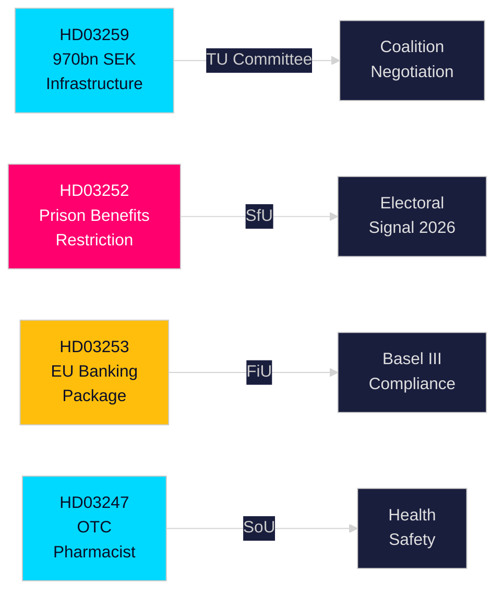

# Exekutivbericht — Schwedische Regierungsvorlagen, 30. April 2026

**Autor**: James Pether Sörling  
**Klassifizierung**: PUBLIC — DSGVO Art. 9(2)(e,g)  
**Konfidenz**: HOCH [B2]  
**Lauf-ID**: 25150587415

---

## 🎯 BLUF

Die Regierung Kristersson hat Ende April 2026 vier bedeutende Gesetzesvorlagen beim Riksdag eingereicht, die Infrastrukturinvestitionen, Strafrechtsreform, EU-Finanzregulierung und Gesundheitsversorgung betreffen. Das Hauptdokument — der Nationale Verkehrsinfrastrukturplan 2026–2037 (HD03259) — verpflichtet historische 970 Milliarden SEK für Schiene, Straße, Seefahrt und Luftfahrt über zwölf Jahre und kodiert eine strategische Wende zur elektrischen Schiene und klimaangepassten Straßen, die regionale Wettbewerbsfähigkeit und industrielle Standortentscheidungen über das nächste Jahrzehnt prägen werden. Parallel dazu verschärfen Vorlagen die soziale Absicherung für Inhaftierte (HD03252), setzen das EU-Bankenpaket in schwedisches Recht um (HD03253) und führen apothekenspezifische Beratungspflichten bei ausgewählten rezeptfreien Arzneimitteln ein (HD03247).

## 🧭 3 Entscheidungen, die dieser Bericht unterstützt

| # | Entscheidung | Relevanz | Horizont |
|---|-------------|----------|----------|
| 1 | Infrastrukturinvestitions- und Standortstrategien für Industrien, die auf Güterverkehr oder E-Straßenausbau angewiesen sind | HD03259 weist erhebliche Mittel für spezifische Korridore zu — Wissen über Gewinner/Verlierer ist handlungsrelevant | 2026–2037 |
| 2 | Compliance-Planung für den Bank-/Finanzsektor bezüglich Basel III/CRR3/CRD6 | HD03253 legt den schwedischen Umsetzungszeitplan fest | 2026–2027 |
| 3 | Sozialpolitische Positionierung für Parteien vor der Herbstwahl 2026 | HD03252 beschränkt Leistungen für elektronisch überwachte Häftlinge — ein hartes Kriminalitätsbekämpfungssignal mit Wahlimplikationen | 2026 H2 |

## ⚡ 60-Sekunden-Lesung

- **Infrastruktur (HD03259)**: 970 Mrd. SEK über 2026–2037; Schienenerhaltung priorisiert; neue Hochgeschwindigkeitssegmente; Norrland-Anbindung; Klimasicherung. Ausschuss: TU.
- **Justiz/Soziales (HD03252)**: Personen, die Strafen in "kontrollerat boende" (Hausarrest mit elektronischer Fußfessel) oder in säkerhetsförvaring (vorbeugende Verwahrung) verbüßen, verlieren den Anspruch auf die meisten Sozialversicherungsleistungen. Ausschuss: SfU. Signalisiert eine eskalierende Recht-und-Ordnung-Haltung.
- **Finanzen/EU (HD03253)**: Schweden setzt das EU-Bankenpaket (CRR3, CRD6, BRRD2-Änderungen) um — vollständige Basel-III-Implementierung, strengere Kapitalpuffer, neue Eigenmittelanforderungen. Finansdepartementet. Ausschuss: FiU.
- **Gesundheit (HD03247)**: Apotheker müssen bei der Abgabe bestimmter rezeptfreier Arzneimittel eine spezifische Beratung leisten, um Missbrauch zu reduzieren. Socialdepartementet. Ausschuss: SoU.

## 🔮 Wichtigster bevorstehender Auslöser

**Infrastrukturabstimmungen im TU-Ausschuss (erwartet Mai–Juni 2026)**: Die Oppositionsparteien SD, S und MP haben unterschiedliche Standpunkte zu den Korridorprioritäten. Eine Minderheitsregierung ohne Einzelpartei-Mehrheit muss verhandeln; beobachten Sie, ob SD Zugeständnisse zur Straße-Schiene-Balance erzwingt.

<!-- source-sha: 363f4a8634f2384be17ea1c3598e718d8d485fa1 -->
