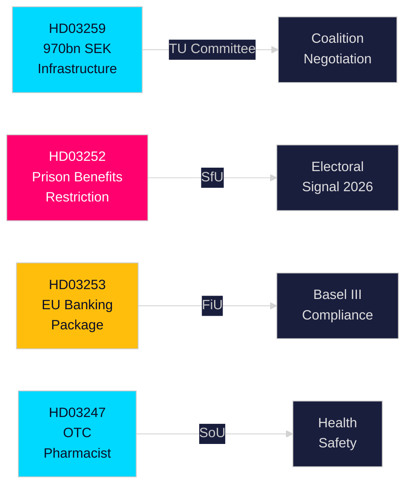

# Informe ejecutivo — Proposiciones del Gobierno sueco, 30 de abril de 2026

**Autor**: James Pether Sörling  
**Clasificación**: PUBLIC — RGPD Art. 9(2)(e,g)  
**Confianza**: ALTA [B2]  
**ID de ejecución**: 25150587415

---

## 🎯 BLUF

El gobierno Kristersson ha presentado al Riksdag cuatro proposiciones significativas a finales de abril de 2026, abarcando inversión en infraestructuras, reforma de la justicia penal, regulación financiera de la UE y acceso a la atención médica. El documento principal — el Plan Nacional de Infraestructura de Transporte 2026–2037 (HD03259) — compromete un histórico 970 mil millones de SEK para ferrocarril, carretera, transporte marítimo y aviación durante doce años, codificando un giro estratégico hacia el ferrocarril eléctrico y las carreteras adaptadas al clima que moldearán la competitividad regional y las decisiones de localización industrial durante la próxima década. Proposiciones paralelas endurecen la seguridad social para personas encarceladas (HD03252), transponen el paquete bancario de la UE al derecho sueco (HD03253) y establecen requisitos de asesoramiento farmacéutico para determinados medicamentos de venta libre (HD03247).

## 🧭 3 decisiones que apoya este informe

| # | Decisión | Relevancia | Horizonte |
|---|---------|------------|-----------|
| 1 | Estrategias de inversión en infraestructura y localización para industrias dependientes del ferrocarril de mercancías o la expansión de las carreteras E | HD03259 asigna fondos importantes a corredores específicos — el conocimiento de ganadores/perdedores es accionable | 2026–2037 |
| 2 | Planificación del cumplimiento para el sector bancario/financiero en Basilea III/CRR3/CRD6 | HD03253 establece el calendario de implementación sueco | 2026–2027 |
| 3 | Posicionamiento sociopolítico para los partidos antes de las elecciones de otoño de 2026 | HD03252 restringe las prestaciones para presos bajo vigilancia electrónica — una señal de dureza ante la delincuencia con implicaciones electorales | 2026 H2 |

## ⚡ Lectura de 60 segundos

- **Infraestructura (HD03259)**: 970 mil millones de SEK durante 2026–2037; mantenimiento ferroviario priorizado; nuevos segmentos de alta velocidad; conectividad de Norrland; adaptación climática. Comisión: TU.
- **Justicia/Social (HD03252)**: Las personas que cumplen condena en "kontrollerat boende" (arresto domiciliario con tobillera electrónica) o en säkerhetsförvaring (internamiento preventivo) pierden el derecho a la mayoría de las prestaciones del seguro social. Comisión: SfU. Señala una postura de ley y orden en escalada.
- **Finanzas/UE (HD03253)**: Suecia transpone el paquete bancario de la UE (CRR3, CRD6, modificaciones BRRD2) — plena implementación de Basilea III, colchones de capital más estrictos, nuevos requisitos de fondos propios. Finansdepartementet. Comisión: FiU.
- **Salud (HD03247)**: Los farmacéuticos deben proporcionar asesoramiento específico al dispensar determinados medicamentos de venta libre para reducir el uso indebido. Socialdepartementet. Comisión: SoU.

## 🔮 Principal desencadenante futuro

**Votos sobre infraestructura en la comisión TU (esperado mayo–junio de 2026)**: Los partidos de la oposición SD, S y MP tienen posiciones divergentes sobre las prioridades de los corredores. Un gobierno minoritario sin mayoría de un solo partido debe negociar; observar si SD extrae concesiones sobre el equilibrio carretera-ferrocarril.

<!-- source-sha: 363f4a8634f2384be17ea1c3598e718d8d485fa1 -->
