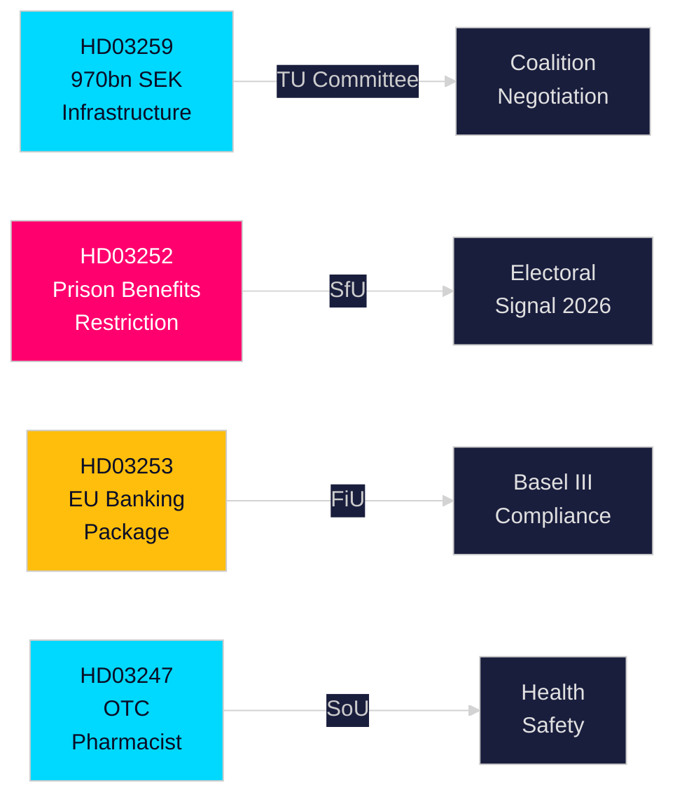

# Toimeenpanoraportti — Ruotsin hallituksen esitykset, 30. huhtikuuta 2026

**Tekijä**: James Pether Sörling  
**Luokittelu**: PUBLIC — GDPR Art. 9(2)(e,g)  
**Luotettavuus**: KORKEA [B2]  
**Ajotunnus**: 25150587415

---

## 🎯 BLUF

Kristersson-hallitus on toimittanut Riksdagille neljä merkittävää esitystä huhtikuun lopussa 2026 infrastruktuuri-investointien, rikosoikeudistuksen, EU:n rahoitussääntelyn ja terveydenhuollon aloilta. Pääasiakirja — Kansallinen liikenneinfrastruktuurisuunnitelma 2026–2037 (HD03259) — sitoo historialliset 970 miljardia SEK rautatiehen, teihin, merenkäyntiin ja ilmailuun kahdentoista vuoden ajalle, ja koodaa strategisen siirtymän sähköiseen rautatieliikenteeeseen ja ilmastonmuutokseen sopeutettuihin teihin, jotka muovaavat alueellista kilpailukykyä ja teollisuuden sijoittumispäätöksiä seuraavalla vuosikymmenellä. Rinnakkaisesitykset tiukentavat vapausrangaistusta suorittavien sosiaaliturvaa (HD03252), saattavat EU:n pankkipaketin osaksi Ruotsin lainsäädäntöä (HD03253) ja asettavat apteekkineuvontavaatimuksen tietyille itsehoitolääkkeille (HD03247).

## 🧭 3 päätöstä, joita tämä raportti tukee

| # | Päätös | Relevanssi | Horisontti |
|---|--------|------------|------------|
| 1 | Infrastruktuuri-investointi- ja sijoittautumisstrategiat tavarajunakuljetuksista tai E-tielaajennuksista riippuvaisille teollisuudenaloille | HD03259 osoittaa suuria varoja tiettyihin käytäviin — tieto voittajista/häviäjistä on toimintakelpoinen | 2026–2037 |
| 2 | Basel III/CRR3/CRD6-vaatimusten noudattamisen suunnittelu pankki-/rahoitussektorille | HD03253 asettaa Ruotsin täytäntöönpanoaikataulun | 2026–2027 |
| 3 | Sosiaalipolitiikka-asemoituminen puolueille ennen syksyn 2026 vaaleja | HD03252 rajoittaa etuuksia elektronisesti valvotuille vangeille — kova rikostorjuntasignaali vaalipoliittisine vaikutuksineen | 2026 H2 |

## ⚡ 60 sekunnin lukeminen

- **Infrastruktuuri (HD03259)**: 970 mrd. SEK vuosina 2026–2037; rautateiden kunnossapito etusijalla; uusia nopearaiteita; Norrlandin liityntä; ilmastokestävyys. Valiokunta: TU.
- **Oikeusturva/sosiaali (HD03252)**: "Kontrollerat boendessa" (kotiaresti elektronisella valvonnalla) tai säkerhetsförvaringissa (ennaltaehkäisevä säilöönotto) tuomionsa suorittavat menettävät oikeuden useimpiin sosiaalivakuutusetuuksiin. Valiokunta: SfU. Viestii koventuvasta laki-ja-järjestys-kannasta.
- **Rahoitus/EU (HD03253)**: Ruotsi saattaa EU:n pankkipaketin (CRR3, CRD6, BRRD2-muutokset) osaksi lainsäädäntöään — täysi Basel III:n täytäntöönpano, tiukemmat pääomapuskurit, uudet omat vaatimukset. Finansdepartementet. Valiokunta: FiU.
- **Terveys (HD03247)**: Apteekkihenkilökunnan on annettava erityinen neuvonta nimettyjen itsehoitolääkkeiden luovutuksen yhteydessä väärinkäytön vähentämiseksi. Socialdepartementet. Valiokunta: SoU.

## 🔮 Tärkein tuleva laukaisin

**TU-valiokunnan infrastruktuuriäänestykset (odotetaan toukokuu–kesäkuu 2026)**: Oppositiopuolueet SD, S ja MP ovat eri mieltä käytäväprioriteeteista. Vähemmistöhallituksen on neuvoteltava ilman yksipuolueen enemmistöä; seuraa, aiheuttaako SD myönnytyksiä tie- ja rautatieliikenteen välisessä tasapainossa.

<!-- source-sha: 363f4a8634f2384be17ea1c3598e718d8d485fa1 -->
