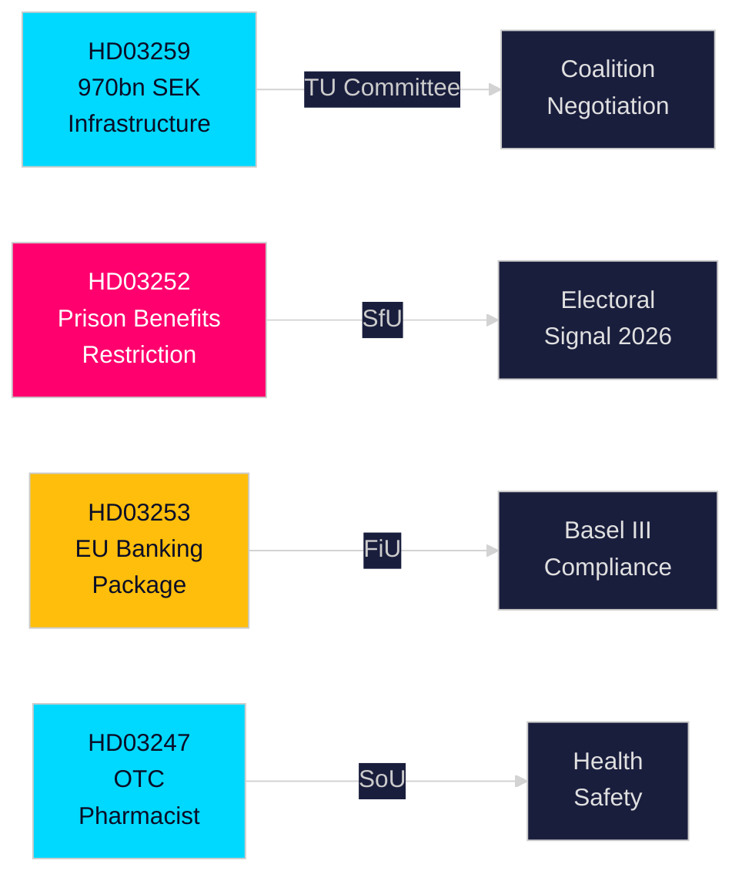

# Note exécutive — Propositions gouvernementales suédoises, 30 avril 2026

**Auteur** : James Pether Sörling  
**Classification** : PUBLIC — RGPD Art. 9(2)(e,g)  
**Confiance** : HAUTE [B2]  
**ID d'exécution** : 25150587415

---

## 🎯 BLUF

Le gouvernement Kristersson a soumis quatre propositions importantes au Riksdag fin avril 2026, portant sur les investissements en infrastructures, la réforme de la justice pénale, la réglementation financière européenne et l'accès aux soins de santé. Le document principal — le Plan national de transport d'infrastructure 2026–2037 (HD03259) — engage 970 milliards de SEK historiques pour le rail, la route, le maritime et l'aviation sur douze ans, codifiant un pivot stratégique vers le rail électrique et les routes adaptées au climat qui façonneront la compétitivité régionale et les décisions de localisation industrielle au cours de la prochaine décennie. Des propositions parallèles renforcent la sécurité sociale pour les personnes incarcérées (HD03252), transposent le paquet bancaire européen en droit suédois (HD03253) et instaurent des exigences de conseil pharmaceutique pour certains médicaments en vente libre (HD03247).

## 🧭 3 décisions que cette note soutient

| # | Décision | Pertinence | Horizon |
|---|---------|------------|---------|
| 1 | Stratégies d'investissement en infrastructure et de localisation pour les industries dépendant du fret ferroviaire ou de l'expansion des routes E | HD03259 alloue des fonds importants à des corridors spécifiques — la connaissance des gagnants/perdants est exploitable | 2026–2037 |
| 2 | Planification de la conformité pour le secteur bancaire/financier concernant Bâle III/CRR3/CRD6 | HD03253 fixe le calendrier de mise en œuvre suédois | 2026–2027 |
| 3 | Positionnement sociopolitique pour les partis avant les élections d'automne 2026 | HD03252 restreint les prestations pour les détenus sous surveillance électronique — un signal de fermeté anti-criminalité aux implications électorales | 2026 H2 |

## ⚡ Lecture en 60 secondes

- **Infrastructures (HD03259)** : 970 Mds SEK sur 2026–2037 ; entretien ferroviaire priorisé ; nouveaux segments à grande vitesse ; connectivité Norrland ; adaptation climatique. Commission : TU.
- **Justice/Social (HD03252)** : Les personnes purgeant des peines en "kontrollerat boende" (assignation à résidence avec bracelet électronique) ou en säkerhetsförvaring (détention préventive) perdent leur droit à la plupart des prestations d'assurance sociale. Commission : SfU. Signale une posture loi-et-ordre en escalade.
- **Finance/UE (HD03253)** : La Suède transpose le paquet bancaire européen (CRR3, CRD6, amendements BRRD2) — pleine mise en œuvre de Bâle III, coussins de capital plus stricts, nouvelles exigences en fonds propres. Finansdepartementet. Commission : FiU.
- **Santé (HD03247)** : Les pharmaciens doivent fournir des conseils spécifiques lors de la délivrance de certains médicaments en vente libre pour réduire les abus. Socialdepartementet. Commission : SoU.

## 🔮 Principal déclencheur à venir

**Votes sur l'infrastructure en commission TU (attendu mai–juin 2026)** : Les partis d'opposition SD, S et MP ont des positions divergentes sur les priorités de corridors. Un gouvernement minoritaire sans majorité d'un seul parti doit négocier ; surveiller si SD extrait des concessions sur l'équilibre route-rail.

<!-- source-sha: 363f4a8634f2384be17ea1c3598e718d8d485fa1 -->
