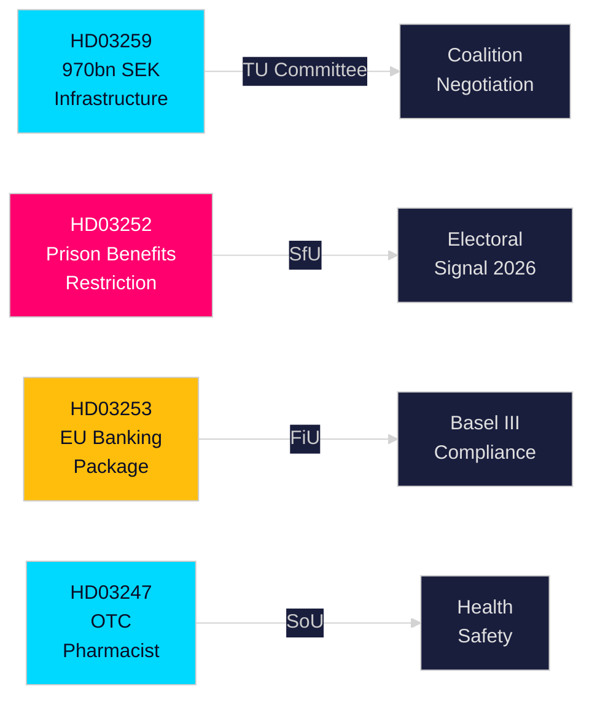

<!-- dir: rtl -->
# תקציר מנהלים — הצעות חוק של ממשלת שוודיה, 30 באפריל 2026

**מחבר**: James Pether Sörling  
**סיווג**: PUBLIC — GDPR סעיף 9(2)(e,g)  
**רמת ביטחון**: גבוהה [B2]  
**מזהה ריצה**: 25150587415

---

## 🎯 BLUF

ממשלת קריסטרסון הגישה לריקסדאג ארבע הצעות חוק משמעותיות בסוף אפריל 2026, הנוגעות להשקעות בתשתיות, רפורמת צדק פלילי, רגולציה פיננסית אירופאית וגישה לשירותי בריאות. המסמך המרכזי — התוכנית הלאומית לתשתית תחבורה 2026–2037 (HD03259) — מחייב 970 מיליארד SEK היסטוריים לרכבת, כביש, ים ותעופה על פני שתים-עשרה שנים, ומקדד מפנה אסטרטגי לרכבת חשמלית ולכבישים מותאמי אקלים שיעצבו את התחרותיות האזורית והחלטות מיקום תעשייתי בעשור הבא. הצעות מקבילות מחמירות את הביטוח הלאומי לעצורים (HD03252), משלבות את חבילת הבנקאות של האיחוד האירופי בחוק השוודי (HD03253), ומטילות דרישות ייעוץ פרמצבטי לתרופות מסוימות ללא מרשם (HD03247).

## 🧭 3 החלטות שתקציר זה תומך בהן

| # | החלטה | רלוונטיות | אופק |
|---|------|----------|------|
| 1 | אסטרטגיות השקעה בתשתיות ומיקום לתעשיות התלויות בשינוע מטען ברכבת או בהרחבת כבישים אירופאיים | HD03259 מקצה כספים ניכרים למסדרונות ספציפיים — ידע על מנצחים/מפסידים הוא בר-פעולה | 2026–2037 |
| 2 | תכנון ציות לסקטור הבנקאי/פיננסי לפי בזל III/CRR3/CRD6 | HD03253 קובע את לוח הזמנים לביצוע השוודי | 2026–2027 |
| 3 | מיצוב סוציו-פוליטי למפלגות לקראת הבחירות בסתיו 2026 | HD03252 מגביל גמלאות לאסירים בפיקוח אלקטרוני — אות "חוק וסדר" עם השלכות בחירתיות | 2026 H2 |

## ⚡ קריאה של 60 שניות

- **תשתיות (HD03259)**: 970 מיליארד SEK בין 2026–2037; תחזוקת רכבת בעדיפות; מקטעי מהירות גבוהה חדשים; קישוריות נוררלנד; הסתגלות לאקלים. ועדה: TU.
- **משפטי/סוציאלי (HD03252)**: אנשים המרצים עונשים ב"kontrollerat boende" (מעצר בית עם אזיק אלקטרוני) או ב-säkerhetsförvaring (מעצר מניעתי) מאבדים את הזכאות לרוב גמלאות הביטוח הלאומי. ועדה: SfU. מאותת על עמדת חוק וסדר מסלימה.
- **פיננסים/האיחוד האירופי (HD03253)**: שוודיה משלבת חבילת הבנקאות האירופאית (CRR3, CRD6, תיקוני BRRD2) — יישום מלא של בזל III, כריות הון מחמירות יותר, דרישות הון עצמי חדשות. Finansdepartementet. ועדה: FiU.
- **בריאות (HD03247)**: פרמצבטים חייבים לספק ייעוץ ספציפי בעת מתן תרופות מסוימות ללא מרשם כדי לצמצם שימוש לרעה. Socialdepartementet. ועדה: SoU.

## 🔮 הגורם המעורר הקריטי הבא

**הצבעות תשתיות בוועדת TU (צפוי מאי–יוני 2026)**: למפלגות האופוזיציה SD, S ו-MP עמדות שונות בנוגע לעדיפויות המסדרונות. ממשלת מיעוט ללא רוב של מפלגה אחת חייבת לנהל משא ומתן; עקוב אחר האם SD ידרוש ויזכה בהחלטות לגבי איזון כביש-רכבת.

<!-- source-sha: 363f4a8634f2384be17ea1c3598e718d8d485fa1 -->
