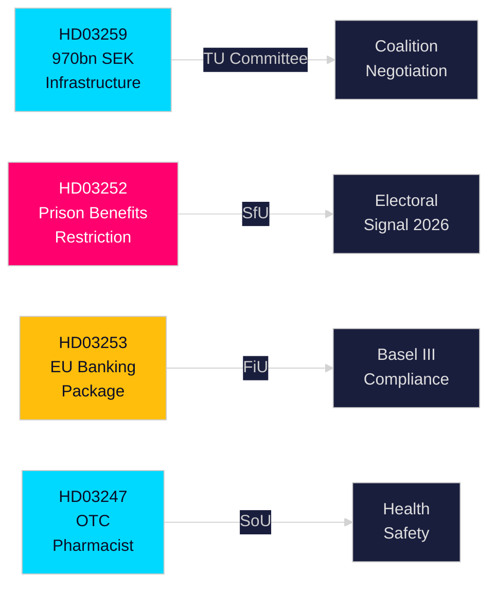

# エグゼクティブブリーフ — スウェーデン政府提出法案、2026年4月30日

**著者**: James Pether Sörling  
**分類**: PUBLIC — GDPR第9条(2)(e,g)  
**信頼度**: 高 [B2]  
**実行ID**: 25150587415

---

## 🎯 BLUF

クリステション政権は2026年4月下旬、インフラ投資、刑事司法改革、EU金融規制、医療アクセスにわたる4件の重要な法案をリクスダーグに提出した。主要文書——国家交通インフラ計画2026–2037（HD03259）——は12年間にわたり鉄道・道路・海運・航空に向けた歴史的な9700億スウェーデン・クローナを拠出し、電気鉄道および気候対応道路への戦略的転換を法制化する。これは今後10年間、地域競争力と産業立地決定を左右する。並行する法案は、収監者の社会保障を厳格化し（HD03252）、EU銀行パッケージをスウェーデン法に転換し（HD03253）、特定の市販薬に薬剤師による指導義務を導入する（HD03247）。

## 🧭 本ブリーフが支援する3つの意思決定

| # | 意思決定 | 関連性 | 時間軸 |
|---|---------|--------|--------|
| 1 | 貨物鉄道やE道路拡張に依存する産業のインフラ投資・立地戦略 | HD03259は特定回廊に多大な資金を配分——勝者/敗者の知識は実行可能 | 2026–2037 |
| 2 | バーゼルIII/CRR3/CRD6に関する銀行・金融セクターのコンプライアンス計画 | HD03253がスウェーデンの実施スケジュールを設定 | 2026–2027 |
| 3 | 2026年秋の選挙に向けた各党の社会政策ポジショニング | HD03252は電子監視下の受刑者の給付を制限——犯罪への厳格対応シグナルで選挙への含意あり | 2026 H2 |

## ⚡ 60秒読み

- **インフラ（HD03259）**: 2026–2037年の9700億クローナ；鉄道維持管理を優先；新たな高速路線；ノルランド接続；気候強靭化。委員会：TU。
- **司法/社会（HD03252）**: "kontrollerat boende"（電子タグ付き自宅拘禁）またはsäkerhetsförvaring（予防的拘禁）で刑を服している者は、ほとんどの社会保険給付の受給権を失う。委員会：SfU。法と秩序姿勢の強化を示す。
- **財政/EU（HD03253）**: スウェーデンはEU銀行パッケージ（CRR3、CRD6、BRRD2改正）を転換——バーゼルIIIの完全実施、より厳しい資本バッファー、新たな自己資本要件。Finansdepartementet。委員会：FiU。
- **保健（HD03247）**: 薬剤師は、指定された市販薬を調剤する際に具体的な指導を行い、乱用を削減しなければならない。Socialdepartementet。委員会：SoU。

## 🔮 最重要の将来トリガー

**TU委員会のインフラ採決（2026年5月〜6月予定）**: 野党のSD、S、MPは回廊優先事項について異なる立場を持つ。単独過半数のない少数派政府は交渉が必要；SDが道路対鉄道バランスで譲歩を引き出すかに注目。

<!-- source-sha: 363f4a8634f2384be17ea1c3598e718d8d485fa1 -->
