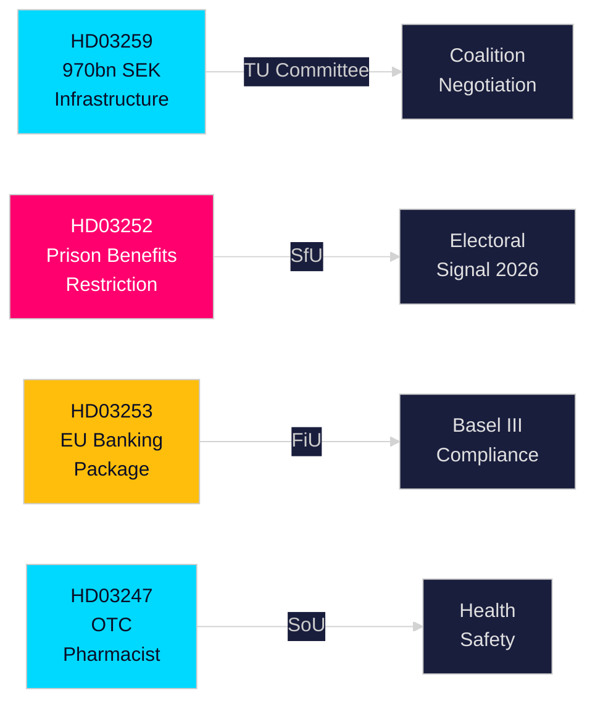

# 집행 브리핑 — 스웨덴 정부 제출 법안, 2026년 4월 30일

**저자**: James Pether Sörling  
**분류**: PUBLIC — GDPR 제9조(2)(e,g)  
**신뢰도**: 높음 [B2]  
**실행 ID**: 25150587415

---

## 🎯 핵심 요약

크리스테르손 정부는 2026년 4월 말 인프라 투자, 형사사법 개혁, EU 금융 규제, 의료 접근성에 걸친 네 가지 중요한 법안을 릭스다그에 제출했다. 주요 문서인 국가 교통인프라 계획 2026–2037(HD03259)은 12년에 걸쳐 철도·도로·해상·항공에 역사적인 9,700억 스웨덴 크로나를 투입하며, 전기철도와 기후 적응 도로로의 전략적 전환을 법제화한다. 이는 향후 10년간 지역 경쟁력과 산업 입지 결정을 형성하게 될 것이다. 병행 법안들은 수용자 사회보장을 강화하고(HD03252), EU 은행 패키지를 스웨덴법에 편입하며(HD03253), 특정 일반의약품에 대한 약사 상담 의무를 도입한다(HD03247).

## 🧭 이 브리핑이 지원하는 3가지 의사결정

| # | 의사결정 | 관련성 | 시간대 |
|---|---------|--------|--------|
| 1 | 화물 철도 또는 유럽 도로 확장에 의존하는 산업의 인프라 투자·입지 전략 | HD03259는 특정 회랑에 상당한 자금을 배정——승자/패자 파악은 실행 가능 | 2026–2037 |
| 2 | 바젤III/CRR3/CRD6에 대한 은행·금융 부문 컴플라이언스 계획 | HD03253이 스웨덴 이행 일정 설정 | 2026–2027 |
| 3 | 2026년 가을 선거를 앞둔 각 정당의 사회정책 포지셔닝 | HD03252는 전자 감시 수감자 혜택 제한——범죄 강경 대응 신호로 선거적 함의 | 2026 H2 |

## ⚡ 60초 읽기

- **인프라(HD03259)**: 2026–2037년 9,700억 크로나；철도 유지관리 우선；새로운 고속 구간；노르란드 연결；기후 강화. 위원회: TU.
- **사법/사회(HD03252)**: "kontrollerat boende"(전자 발찌 가택 구금) 또는 säkerhetsförvaring(예방적 구금)에서 형을 복역하는 자는 대부분의 사회보험 급여 자격을 상실. 위원회: SfU. 법과 질서 입장 강화를 신호.
- **금융/EU(HD03253)**: 스웨덴, EU 은행 패키지(CRR3, CRD6, BRRD2 개정) 국내법화——바젤III 완전 이행, 엄격한 자본 완충, 새로운 자기자본 요건. Finansdepartementet. 위원회: FiU.
- **보건(HD03247)**: 약사는 특정 일반의약품 조제 시 구체적 지도를 제공해 오용을 줄여야 함. Socialdepartementet. 위원회: SoU.

## 🔮 가장 중요한 향후 촉발 요인

**TU 위원회 인프라 표결(2026년 5–6월 예정)**: 야당 SD, S, MP는 회랑 우선순위에 대해 서로 다른 입장. 단독 과반수 없는 소수파 정부는 협상이 필요；SD가 도로 대 철도 균형에서 양보를 끌어내는지 주목.

<!-- source-sha: 363f4a8634f2384be17ea1c3598e718d8d485fa1 -->
