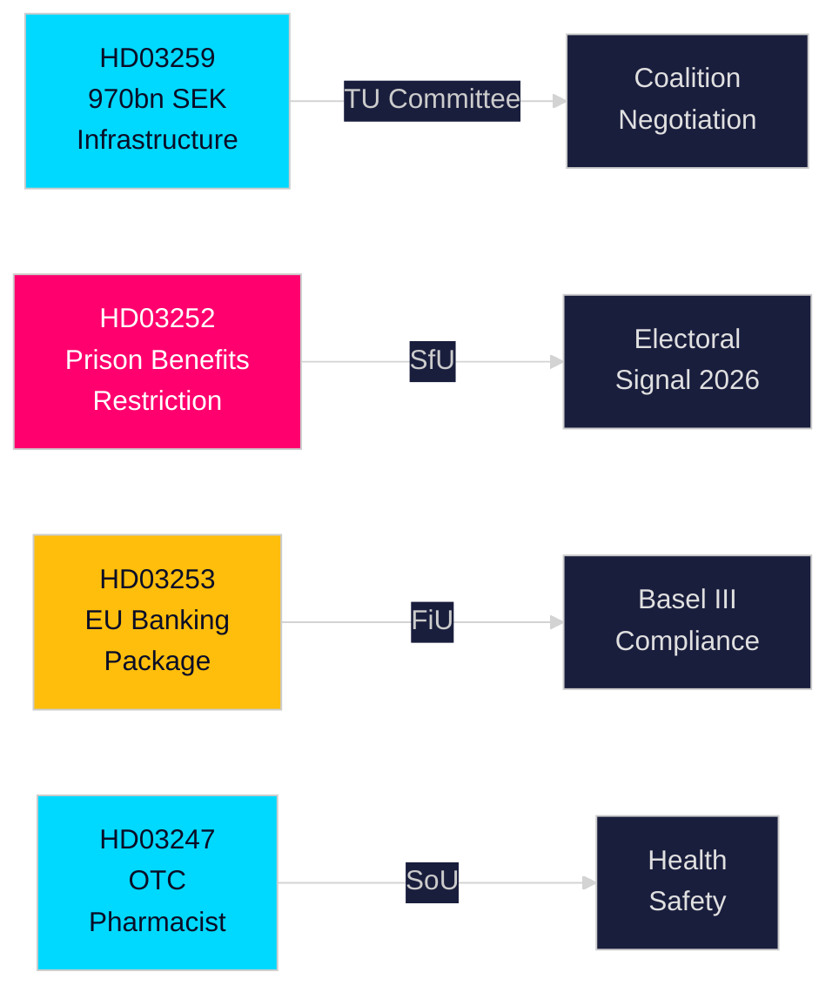

# Uitvoerend rapport — Zweedse regeringsvoorstellen, 30 april 2026

**Auteur**: James Pether Sörling  
**Classificatie**: PUBLIC — AVG Art. 9(2)(e,g)  
**Vertrouwen**: HOOG [B2]  
**Loop-ID**: 25150587415

---

## 🎯 BLUF

De regering-Kristersson heeft eind april 2026 vier significante wetsvoorstellen ingediend bij de Riksdag, die betrekking hebben op infrastructuurinvesteringen, strafrechtshervorming, EU-financiële regelgeving en toegang tot gezondheidszorg. Het hoofddocument — het Nationaal Vervoersinfrastructuurplan 2026–2037 (HD03259) — verbindt historische 970 miljard SEK aan spoor, weg, maritiem vervoer en luchtvaart over twaalf jaar, en codeert een strategische ommezwaai naar elektrisch spoor en klimaatbestendige wegen die de regionale concurrentiekracht en industriële vestigingsbeslissingen in het volgende decennium zullen vormen. Parallelle voorstellen verscherpen de sociale zekerheid voor gedetineerden (HD03252), transponen het EU-bankenpakket in Zweeds recht (HD03253) en stellen farmaciebegeleiding in voor geselecteerde vrij verkrijgbare geneesmiddelen (HD03247).

## 🧭 3 beslissingen die dit rapport ondersteunt

| # | Beslissing | Relevantie | Horizon |
|---|-----------|------------|---------|
| 1 | Infrastructuurinvesterings- en vestigingsstrategieën voor industrieën afhankelijk van goederenspoor of E-weguitbreiding | HD03259 wijst aanzienlijke fondsen toe aan specifieke corridors — kennis van winnaars/verliezers is uitvoerbaar | 2026–2037 |
| 2 | Compliance-planning voor de bank-/financiële sector voor Bazel III/CRR3/CRD6 | HD03253 stelt de Zweedse implementatietijdlijn vast | 2026–2027 |
| 3 | Sociaal-politieke positionering voor partijen vóór de herfstverkiezingen 2026 | HD03252 beperkt uitkeringen voor elektronisch gecontroleerde gevangenen — een harde misdaadbestrijdingssignaal met electorale implicaties | 2026 H2 |

## ⚡ 60-seconden lezing

- **Infrastructuur (HD03259)**: 970 mrd. SEK over 2026–2037; spooronderhoud geprioriteerd; nieuwe hogesnelheidssegmenten; Norrland-verbinding; klimaatbestendigheid. Commissie: TU.
- **Justitie/Sociaal (HD03252)**: Personen die straffen uitzitten in "kontrollerat boende" (huisarrest met elektronische enkelbanden) of in säkerhetsförvaring (preventieve hechtenis) verliezen het recht op de meeste sociale verzekeringsuitkeringen. Commissie: SfU. Signaleert een escalerende wet-en-orde-houding.
- **Financiën/EU (HD03253)**: Zweden transponeert het EU-bankenpakket (CRR3, CRD6, BRRD2-wijzigingen) — volledige Bazel III-implementatie, strengere kapitaalbuffers, nieuwe eigenvermogensvereisten. Finansdepartementet. Commissie: FiU.
- **Gezondheid (HD03247)**: Apothekers moeten specifieke begeleiding bieden bij de afgifte van aangewezen vrij verkrijgbare geneesmiddelen om misbruik te verminderen. Socialdepartementet. Commissie: SoU.

## 🔮 Belangrijkste toekomstige trigger

**Infrastructuurstemmen in TU-commissie (verwacht mei–juni 2026)**: Oppositiepartijen SD, S en MP hebben uiteenlopende standpunten over de corridorprioriteiten. Een minderheidsregering zonder meerderheid van één partij moet onderhandelen; let op of SD concessies afdwingt over de weg-spoor-balans.

<!-- source-sha: 363f4a8634f2384be17ea1c3598e718d8d485fa1 -->
