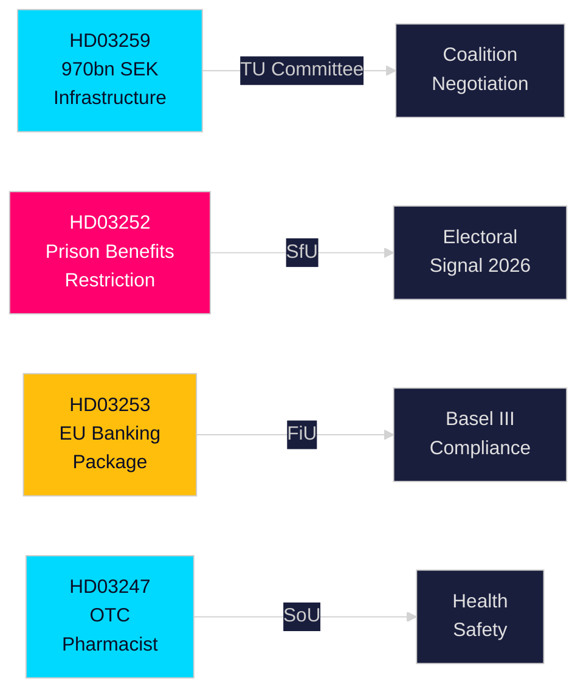

# Eksekutivrapport — Svenske regjeringsproposisjoner, 30. april 2026

**Forfatter**: James Pether Sörling  
**Klassifisering**: PUBLIC — GDPR Art. 9(2)(e,g)  
**Konfidensgrad**: HØY [B2]  
**Kjørings-ID**: 25150587415

---

## 🎯 BLUF

Kristersson-regjeringen har i slutten av april 2026 lagt frem fire viktige proposisjoner for Riksdagen, innen infrastrukturinvesteringer, strafferettereform, EU-finansregulering og helsetjenester. Hoveddokumentet — Nasjonal transportinfrastrukturplan 2026–2037 (HD03259) — forplikter historiske 970 milliarder SEK til jernbane, vei, sjøfart og luftfart over tolv år og kodifiserer et strategisk skifte mot elektrisk jernbane og klimatilpassede veier som vil forme regional konkurransekraft og industrielle lokaliseringsbeslutninger gjennom neste tiår. Parallelle proposisjoner strammer inn sosial trygghet for frihetsberøvede (HD03252), gjennomfører EUs bankpakke i svensk rett (HD03253) og innfører krav om farmasøytisk rådgivning ved salg av utvalgte reseptfrie legemidler (HD03247).

## 🧭 3 beslutninger denne rapporten støtter

| # | Beslutning | Relevans | Horisont |
|---|-----------|----------|----------|
| 1 | Infrastrukturinvesterings- og lokaliseringsstrategier for industrier avhengige av godstog eller E-veiutbygging | HD03259 avsetter store midler til spesifikke korridorer — kunnskap om vinnere/tapere er handlingsbar | 2026–2037 |
| 2 | Compliance-planlegging for bank-/finanssektoren for Basel III/CRR3/CRD6 | HD03253 fastsetter den svenske gjennomføringstidsplanen | 2026–2027 |
| 3 | Sosialpolitisk posisjonering for partier foran høstvalget 2026 | HD03252 begrenser ytelser til elektronisk overvåkede innsatte — et tøft-mot-kriminalitet-signal med valgmessige implikasjoner | 2026 H2 |

## ⚡ 60 sekunders lesning

- **Infrastruktur (HD03259)**: 970 mrd. SEK over 2026–2037; jernbanevedlikehold prioritert; nye høyhastighetssegmenter; Norrland-tilkobling; klimasikring. Komité: TU.
- **Strafferett/sosialt (HD03252)**: Personer som soner straffer i "kontrollerat boende" (hjemmefengsel med elektronisk ankellenke) eller i säkerhetsförvaring (preventiv forvaring) mister retten til de fleste sosiale ytelser. Komité: SfU. Signaliserer en eskalerende lov-og-orden-holdning.
- **Finans/EU (HD03253)**: Sverige gjennomfører EUs bankpakke (CRR3, CRD6, BRRD2-endringer) — full Basel III-implementering, strengere kapitalbuffere, nye egenkapitalkrav. Finansdepartementet. Komité: FiU.
- **Helse (HD03247)**: Farmasøyter skal gi spesifikk rådgivning ved utlevering av utpekte reseptfrie legemidler for å redusere misbruk. Socialdepartementet. Komité: SoU.

## 🔮 Viktigste fremtidige utløser

**Infrastrukturvoteringer i TU-komiteen (forventet mai–juni 2026)**: Opposisjonspartiene SD, S og MP har ulike standpunkter om korridor-prioriteringene. En mindretallsregjering uten enkeltpartis flertall må forhandle; følg med på om SD presser frem innrømmelser om balansen mellom vei og jernbane.

<!-- source-sha: 363f4a8634f2384be17ea1c3598e718d8d485fa1 -->
