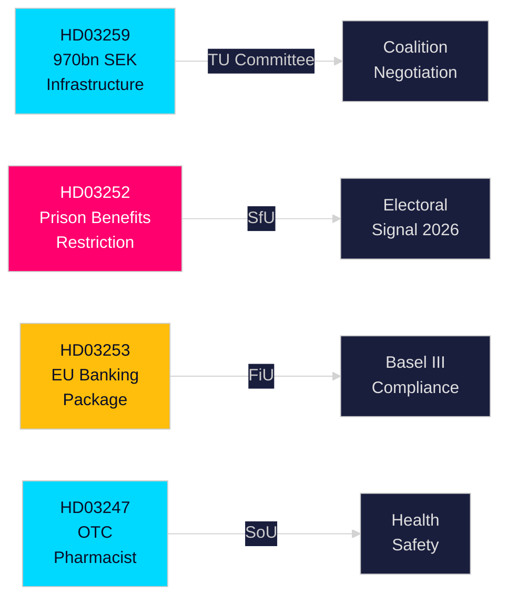

# Exekutiv rapport — Svenska regeringens propositioner, 30 april 2026

**Författare**: James Pether Sörling  
**Klassificering**: PUBLIC — GDPR Art. 9(2)(e,g)  
**Konfidensgrad**: HÖG [B2]  
**Körnings-ID**: 25150587415

---

## 🎯 BLUF

Regeringen Kristersson har i slutet av april 2026 lämnat fyra viktiga propositioner till riksdagen inom infrastrukturinvesteringar, kriminalpolitik, EU-finansreglering och hälso- och sjukvård. Huvuddokumentet — Nationell plan för transportinfrastruktur 2026–2037 (HD03259) — avsätter historiska 970 miljarder kronor till järnväg, väg, sjöfart och luftfart under tolv år, och cementerar en strategisk satsning på elektrisk järnväg och klimatanpassade vägar som kommer att forma regional konkurrenskraft och industrilokaliseringsbeslut under nästa decennium. Parallella propositioner skärper socialförsäkringsregler för frihetsberövade (HD03252), genomför EU:s bankpaket i svensk rätt (HD03253) samt inför krav på farmaceutisk rådgivning vid köp av utvalda receptfria läkemedel (HD03247).

## 🧭 3 beslut som rapporten stödjer

| # | Beslut | Relevans | Horisont |
|---|--------|----------|----------|
| 1 | Infrastrukturinvesterings- och lokaliseringsstrategier för industrier beroende av godstrafik eller E-vägutbyggnad | HD03259 avsätter stora medel till specifika stråk — kunskap om vinnare/förlorare är handlingsbar | 2026–2037 |
| 2 | Compliance-planering för bank-/finanssektor avseende Basel III/CRR3/CRD6 | HD03253 fastställer den svenska genomförandetidsplanen | 2026–2027 |
| 3 | Socialpolirisk positionering för partier inför höstvalet 2026 | HD03252 begränsar förmåner för elektroniskt övervakade intagna — en tuff brottsbekämpningssignal med valimplikationer | 2026 H2 |

## ⚡ 60 sekunders läsning

- **Infrastruktur (HD03259)**: 970 miljarder kronor under 2026–2037; järnvägsunderhåll prioriterat; nya snabbanläggningar; Norrlandsanslutning; klimatsäkring. Utskott: TU.
- **Juridik/socialt (HD03252)**: Personer som avtjänar straff i kontrollerat boende (hemfängelse med elektronisk tagg) eller säkerhetsförvaring förlorar rätten till de flesta socialförsäkringsförmåner. Utskott: SfU. Signalerar en alltmer tuff lag-och-ordningsståndpunkt.
- **Finans/EU (HD03253)**: Sverige genomför EU:s bankpaket (CRR3, CRD6, BRRD2-ändringar) — full Basel III-implementering, strängare kapitalbuffertar, nya kapitalkrav. Finansdepartementet. Utskott: FiU.
- **Hälsa (HD03247)**: Farmaceuter ska lämna specifik rådgivning vid utlämning av utpekade receptfria läkemedel för att minska missbruk. Socialdepartementet. Utskott: SoU.

## 🔮 Viktigaste framtida utlösare

**Omröstning om infrastruktur i TU-utskottet (förväntas maj–juni 2026)**: Oppositionspartier SD, S och MP har skilda åsikter om stråkprioriteringarna. En minoritetsregering utan enkelt partiets majoritet måste förhandla; bevaka om SD utverkar eftergifter om balansen mellan väg och järnväg.

<!-- source-sha: 363f4a8634f2384be17ea1c3598e718d8d485fa1 -->
