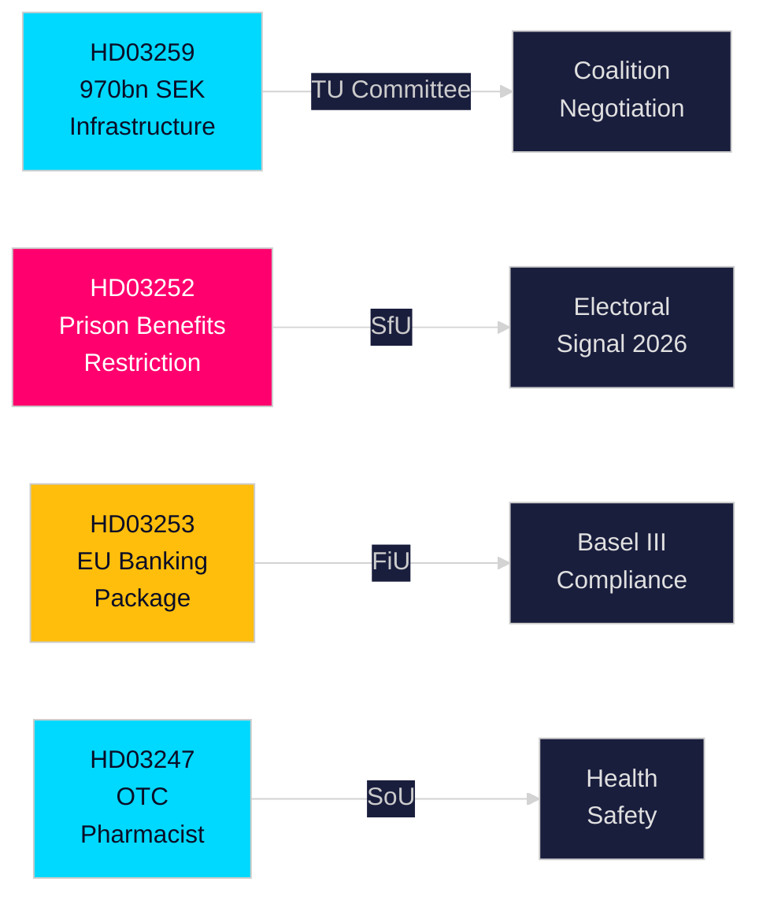

# 执行简报 — 瑞典政府提案，2026年4月30日

**作者**：James Pether Sörling  
**密级**：PUBLIC — GDPR第9条(2)(e,g)  
**置信度**：高 [B2]  
**运行ID**：25150587415

---

## 🎯 核心摘要

克里斯特松政府于2026年4月下旬向瑞典议会（Riksdag）提交了四项重要提案，涵盖基础设施投资、刑事司法改革、欧盟金融监管和医疗保障。主要文件——国家交通基础设施规划2026–2037（HD03259）——承诺在12年内向铁路、公路、航运和航空投入9700亿瑞典克朗，以法律形式确立向电气铁路和气候适应型道路转型的战略，这将在未来十年塑造地区竞争力和工业选址决策。并行提案收紧了对被监禁人员的社会保障（HD03252），将欧盟银行业一揽子方案纳入瑞典法律（HD03253），并为特定非处方药品引入药剂师指导要求（HD03247）。

## 🧭 本简报支持的3项决策

| # | 决策 | 相关性 | 时间范围 |
|---|-----|--------|----------|
| 1 | 依赖货运铁路或欧洲公路扩建的产业基础设施投资与选址策略 | HD03259为特定走廊分配大量资金——了解赢家/输家具有可操作性 | 2026–2037 |
| 2 | 银行/金融业关于巴塞尔III/CRR3/CRD6的合规规划 | HD03253确立瑞典实施时间表 | 2026–2027 |
| 3 | 各党派在2026年秋季大选前的社会政策定位 | HD03252限制电子监控服刑人员的福利——具有选举影响的强硬反犯罪信号 | 2026 H2 |

## ⚡ 60秒速读

- **基础设施（HD03259）**：2026–2037年9700亿克朗；铁路维护优先；新高速路段；诺尔兰连通性；气候防护。委员会：TU。
- **司法/社会（HD03252）**：在"kontrollerat boende"（电子标签居家监禁）或säkerhetsförvaring（预防性拘留）中服刑者丧失大多数社会保险福利权利。委员会：SfU。表明不断升级的法律与秩序立场。
- **金融/欧盟（HD03253）**：瑞典转换欧盟银行业一揽子方案（CRR3、CRD6、BRRD2修订）——全面实施巴塞尔III、更严格的资本缓冲、新的自有资金要求。Finansdepartementet。委员会：FiU。
- **卫生（HD03247）**：药剂师在分发特定非处方药品时必须提供具体指导，以减少滥用。Socialdepartementet。委员会：SoU。

## 🔮 最关键的前瞻触发事件

**TU委员会基础设施表决（预计2026年5–6月）**：反对党SD、S和MP在走廊优先事项上立场各异。无单一政党多数的少数派政府必须谈判；关注SD是否在公路与铁路平衡问题上争取到让步。

<!-- source-sha: 363f4a8634f2384be17ea1c3598e718d8d485fa1 -->
