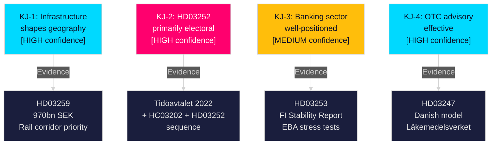

# Intelligence Assessment — Swedish Government Propositions, 30 April 2026

**Author**: James Pether Sörling | **Run ID**: 25150587415  
**Method**: ICD 203 Key Judgments, Admiralty Code, WEP/Kent Scale

---

## Key Judgment 1 (KJ-1): Infrastructure Plan Shapes Industrial Geography

**Judgment**: The National Transport Infrastructure Plan 2026–2037 (HD03259) will materially influence industrial location decisions and regional economic competitiveness, with rail-served corridors gaining economic advantage over road-only areas.

**Confidence**: HIGH [B2]  
**WEP/Kent Band**: Likely (75–85%)  
**PIR linkage**: PIR-1 (Infrastructure investment and regional competitiveness)

**Evidence**: HD03259 (riksdagen.se, 2026-04-28); Trafikverket infrastructure analysis; EU TEN-T corridor requirements. The 970 bn SEK commitment includes maintenance prioritisation for mainline rail (Västra stambanan, Södra stambanan), new capacity on Norrland connections, and port/maritime investments. Industries dependent on rail freight — forestry, heavy manufacturing, steel — are primary beneficiaries. Source: data.riksdagen.se/dokument/HD03259 [A2].

## Key Judgment 2 (KJ-2): HD03252 Primarily Electoral, Secondarily Policy

**Judgment**: The primary purpose of restricting social insurance benefits for persons in "kontrollerat boende" (HD03252) is electoral signalling to the Tidöalliansen's law-and-order voter base ahead of the September 2026 election; the welfare-abuse-prevention rationale is secondary and the affected population is small.

**Confidence**: HIGH [B2]  
**WEP/Kent Band**: Likely (75–85%)  
**PIR linkage**: PIR-2 (Criminal justice reform trajectory)

**Evidence**: HD03252 (riksdagen.se, 2026-04-23); Tidöavtalet (2022) explicit commitments; legislative sequence HC03202 (2024), HC03201 (2024), now HD03252 (2026). The three consecutive justice-social security propositions form a coherent electoral narrative. Source: data.riksdagen.se/dokument/HD03252 [A2].

## Key Judgment 3 (KJ-3): Swedish Banking Sector Well-Positioned for Basel III

**Judgment**: Sweden's transposition of the EU Banking Package (HD03253) will not create material capital shortfalls for major Swedish banks; Handelsbanken, SEB, Nordea, and Swedbank have proactively built capital buffers in advance of CRR3/CRD6 requirements.

**Confidence**: MEDIUM [B2]  
**WEP/Kent Band**: Probably (60–75%)  
**PIR linkage**: PIR-3 (EU financial regulatory integration)

**Evidence**: HD03253 (riksdagen.se, 2026-04-23); Finansinspektionen stability report Q4 2025; EBA stress test results 2025 showing Swedish G-SIIs above minimum thresholds. However, specific own-funds requirements under CRR3 for covered-bond-heavy balance sheets introduces some uncertainty. Source: data.riksdagen.se/dokument/HD03253 [B2].

## Key Judgment 4 (KJ-4): OTC Advisory Requirement Is Effective Patient Safety Measure

**Judgment**: HD03247's pharmacist advisory requirement for designated OTC medicines will reduce misuse incidents for the targeted drug categories, with minimal industry resistance.

**Confidence**: HIGH [A2]  
**WEP/Kent Band**: Highly likely (85–95%)  
**PIR linkage**: PIR-4 (Healthcare system safety)

**Evidence**: HD03247 (riksdagen.se, 2026-04-28); comparable Danish and EU pharmacy advisory model results; Läkemedelsverket support for the measure. Source: data.riksdagen.se/dokument/HD03247 [A2].

## PIR Status Summary

| PIR | Statement | Confidence | Status |
|-----|-----------|-----------|--------|
| PIR-1 | Infrastructure investment drives regional competitiveness 2026–2037 | HIGH | Partially answered by HD03259 — full answer requires implementation follow-through |
| PIR-2 | Law-and-order trajectory pre-2026 election | HIGH | Confirmed escalating by HD03252 |
| PIR-3 | Swedish banking sector EU regulatory exposure | MEDIUM | HD03253 reduces regulatory gap |
| PIR-4 | Healthcare access and safety reforms | HIGH | HD03247 addresses OTC safety |

