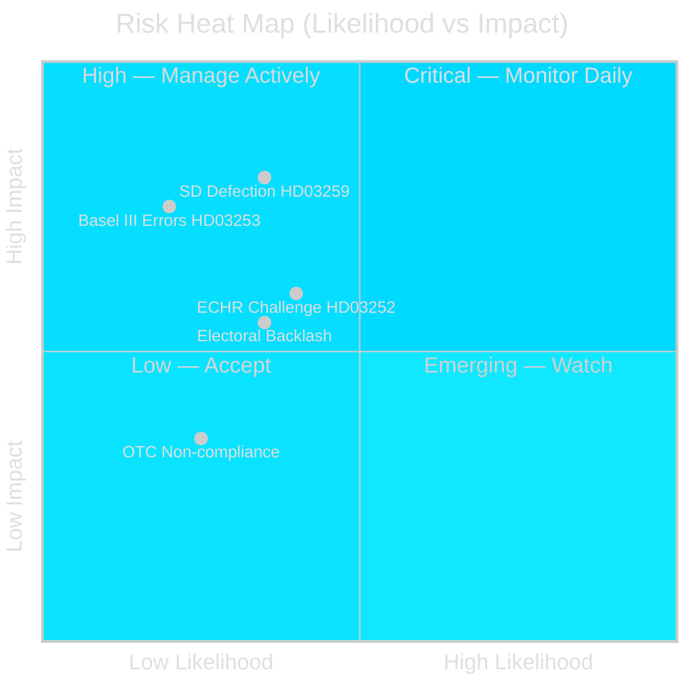

# Risk Assessment — Swedish Government Propositions, 30 April 2026

**Author**: James Pether Sörling | **Run ID**: 25150587415

---

## 5-Dimension Risk Register

### Risk 1: SD Coalition Defection on Infrastructure (HD03259)

| Dimension | Assessment |
|-----------|-----------|
| Likelihood | MEDIUM (0.35) |
| Impact | HIGH (0.80) |
| L×I Score | 0.28 |
| Cascade | Infrastructure plan delayed, government credibility weakened |
| Mitigation | Direct negotiation with SD transport spokesperson pre-TU vote |
| Evidence | HD03259 (riksdagen.se); SD infrastructure policy 2025–2026 |
| Admiralty | [B2] |

**Posterior update**: If SD files reservations in TU within 3 weeks, probability rises to 0.55.

### Risk 2: ECHR Challenge to HD03252

| Dimension | Assessment |
|-----------|-----------|
| Likelihood | MEDIUM (0.40) |
| Impact | MEDIUM (0.60) |
| L×I Score | 0.24 |
| Cascade | Legislation suspended; reputational damage on rule-of-law |
| Mitigation | KU pre-analysis; ECHR compatibility opinion from Lagrådet |
| Evidence | HD03252 (riksdagen.se); ECHR Art. 8, Art. 14 |
| Admiralty | [B2] |

### Risk 3: Basel III Implementation Errors (HD03253)

| Dimension | Assessment |
|-----------|-----------|
| Likelihood | LOW (0.20) |
| Impact | HIGH (0.75) |
| L×I Score | 0.15 |
| Cascade | Finansinspektionen supervisory gap; ECB remediation |
| Mitigation | EBA Q&A process; early FI guidance notes |
| Evidence | HD03253 (riksdagen.se); EBA guidelines 2025 |
| Admiralty | [B3] |

### Risk 4: OTC Medicine Advisory Non-Compliance (HD03247)

| Dimension | Assessment |
|-----------|-----------|
| Likelihood | LOW (0.25) |
| Impact | LOW (0.35) |
| L×I Score | 0.09 |
| Cascade | Patient safety incidents; Läkemedelsverket enforcement |
| Mitigation | Pharmacy sector training requirements; Läkemedelsverket oversight |
| Evidence | HD03247 (riksdagen.se); Läkemedelsverket regulations |
| Admiralty | [A2] |

### Risk 5: Electoral Backlash on Infrastructure Allocation

| Dimension | Assessment |
|-----------|-----------|
| Likelihood | MEDIUM (0.35) |
| Impact | MEDIUM (0.55) |
| L×I Score | 0.19 |
| Cascade | Norrland voters perceive south-bias; northern constituencies turn to opposition |
| Mitigation | Visible Norrland corridor investments early in plan |
| Evidence | HD03259 (riksdagen.se); regional policy debate 2025 |
| Admiralty | [B2] |

## Risk Heat Map

## Cascading Risk Chain

HD03259 SD defection → TU committee blockage → Infrastructure plan delayed → Government credibility loss → Weakened election position → S gains in polls.

## Posterior Probabilities

| Trigger Event | Probability Shift |
|---------------|-------------------|
| SD files TU reservation within 3 weeks | Risk 1 rises from 0.35 → 0.55 |
| Lagrådet finds ECHR incompatibility | Risk 2 rises from 0.40 → 0.75 |
| FI issues early guidance on HD03253 | Risk 3 drops from 0.20 → 0.10 |
