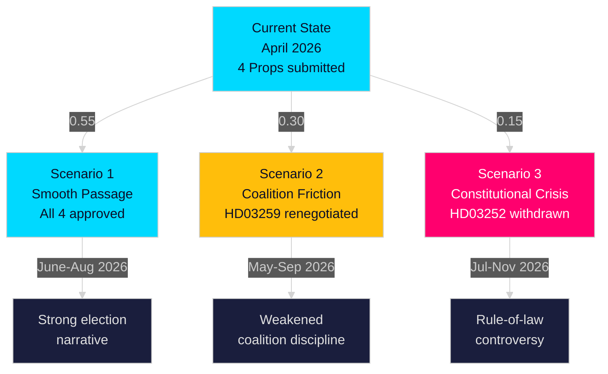

# Scenario Analysis — Swedish Government Propositions, 30 April 2026

**Author**: James Pether Sörling | **Run ID**: 25150587415

---

## Scenario 1: Smooth Legislative Passage (Baseline)

**Probability**: 0.55 [B2]  
**Horizon**: June–August 2026

All four propositions pass the Riksdag with minor amendments. SD accepts the transport plan's rail/road balance after receiving assurances on one or two road corridor upgrades. HD03252 passes with Lagrådet approval; HD03253 meets EU compliance deadline; HD03247 is non-controversial.

**Indicators that this scenario is developing**:
- TU committee hearing schedule set without SD reservation by mid-May
- Lagrådet opinion on HD03252 issued with minor remarks only
- FiU approves HD03253 on expedited basis (EU deadline)

**Implications**: Government enters autumn election campaign with strong legislative record; infrastructure plan becomes centrepiece of M/KD/L campaign messaging.

## Scenario 2: Coalition Friction on Infrastructure (Risk Scenario)

**Probability**: 0.30 [B2]  
**Horizon**: May–September 2026

SD demands significant road corridor additions to HD03259, threatening to abstain on the plan or vote with opposition on amendments. Government is forced to renegotiate, causing a 2–4 month delay and reshaping the plan. The final version allocates more to roads in Götaland at the expense of northern rail maintenance.

**Indicators**:
- SD files formal reservations in TU by 15 May 2026
- Media reports of SD-government backstage negotiation
- Revised Trafikverket allocation tables circulated

**Implications**: Government weakened entering election; SD demonstrates leverage; northern constituencies may feel ignored; broader coalition discipline questioned.

## Scenario 3: Constitutional Crisis (Low-Probability, High-Impact)

**Probability**: 0.15 [B3]  
**Horizon**: July–November 2026

Lagrådet finds HD03252 fundamentally incompatible with ECHR Art. 8. Government withdraws the proposition or submits a substantially revised version that narrows scope to only full-custody prisoners (not "kontrollerat boende"). KU opens a constitutional review. The resulting controversy overshadows the infrastructure plan in media coverage.

**Indicators**:
- Lagrådet opinion raises fundamental rights concerns (expected May–June 2026)
- JO (Justitieombudsmannen) receives complaints from sentenced persons
- S, V, MP table interpellation demanding withdrawal

**Implications**: Government's law-and-order brand damaged; opposition gains credibility on rule-of-law; election campaign complicated by constitutional controversy.

