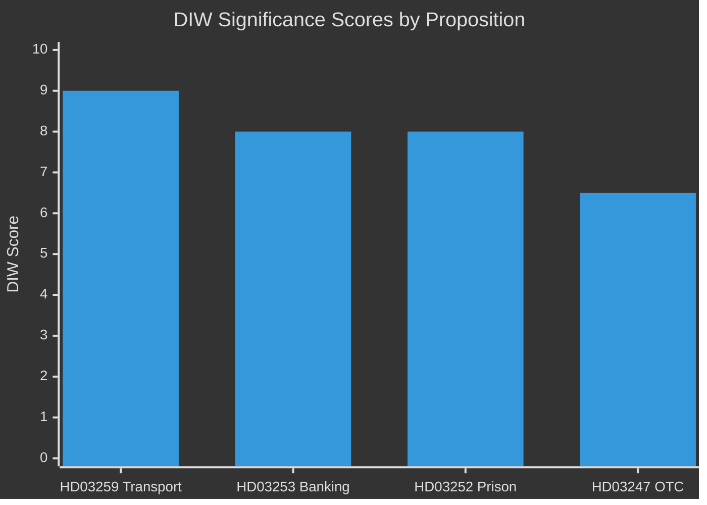

# Significance Scoring — Swedish Government Propositions, 30 April 2026

**Author**: James Pether Sörling | **Run ID**: 25150587415  
**Method**: DIW (Detectability × Impact × Willingness) weighted ranking

---

## Ranked Significance

1. **HD03259** — Nationell planering för transportinfrastrukturen 2026–2037 [riksdagen.se, data.riksdagen.se/dokument/HD03259]
   - Detectability: 9/10 (published skrivelse, publicly debated)
   - Impact: 10/10 (970 bn SEK, 12-year horizon, systemic national effect)
   - Willingness: 8/10 (government has majority to advance; opposition procedural scrutiny expected)
   - **DIW Score: 9.0** | Priority: P0

2. **HD03253** — EU:s bankpaket [riksdagen.se, data.riksdagen.se/dokument/HD03253]
   - Detectability: 7/10 (technical EU transposition, media coverage moderate)
   - Impact: 8/10 (affects capital requirements for all Swedish banks)
   - Willingness: 9/10 (EU obligation, cross-party support for transposition)
   - **DIW Score: 8.0** | Priority: P1

3. **HD03252** — Begränsning av socialförsäkringsförmåner för dömda [riksdagen.se, data.riksdagen.se/dokument/HD03252]
   - Detectability: 8/10 (high media salience on crime/justice)
   - Impact: 7/10 (affects sentenced persons' benefits; electoral signal nationally)
   - Willingness: 9/10 (Tidöalliansen strong majority for this type of measure)
   - **DIW Score: 8.0** | Priority: P1

4. **HD03247** — Receptfria läkemedel med krav på rådgivning [riksdagen.se, data.riksdagen.se/dokument/HD03247]
   - Detectability: 6/10 (specialist health press)
   - Impact: 5/10 (patient safety improvement, narrow scope)
   - Willingness: 9/10 (broad cross-party health safety consensus)
   - **DIW Score: 6.5** | Priority: P2

## Sensitivity Analysis

If infrastructure plan receives SD demands for road re-weighting, DIW for HD03259 political controversy rises to 9.5. If EU banking package faces parliamentary delay, HD03253 impact score holds but willingness drops to 6 (unlikely).

## Priority Tier Summary

| Tier | dok_id | Committee | Urgency |
|------|--------|-----------|---------|
| P0 | HD03259 | TU | High — national infrastructure, 12-yr commitment |
| P1 | HD03253 | FiU | Medium — EU compliance deadline |
| P1 | HD03252 | SfU | Medium-High — election-year policy signal |
| P2 | HD03247 | SoU | Standard — health safety, non-controversial |
