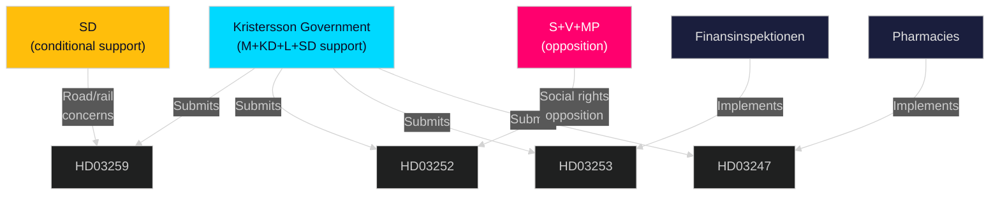

# Stakeholder Perspectives — Swedish Government Propositions, 30 April 2026

**Author**: James Pether Sörling | **Run ID**: 25150587415

---

## HD03259 — Transport Infrastructure Plan 2026–2037

### Proponents

| Actor | Role | Position | Evidence |
|-------|------|----------|----------|
| M (Moderaterna) | Lead coalition party | Strong support — frames as industrial competitiveness and climate | HD03259 (riksdagen.se); Jakob Forssmed/Andreas Carlson (KD/M) presenting |
| KD (Kristdemokraterna) | Coalition | Support — rural connectivity, Norrland priority | HD03259 (riksdagen.se) |
| Swedish Association of Local Authorities (SKR) | Stakeholder | Generally supportive — regional infrastructure benefits municipalities | SKR infrastructure position 2025 |
| Trafikverket | Implementation | Technical supporter — plan provides mandate | HD03259 (riksdagen.se) |

### Opponents / Critics

| Actor | Role | Position | Evidence |
|-------|------|----------|----------|
| SD (Sverigedemokraterna) | Coalition support party | Mixed — demands road/rail balance adjustment | SD transport policy 2025; HD03259 (riksdagen.se) TU referral |
| Environmental groups | Advocacy | Supports electrification, critical of any road expansion | SNF/WWF Sweden statements |
| S (Socialdemokraterna) | Main opposition | Supportive in principle but will propose alternative allocations | S infrastructure motion 2025/26 |

## HD03252 — Social Security Restriction for Prisoners

### Proponents

| Actor | Role | Position | Evidence |
|-------|------|----------|----------|
| M, SD, KD, L | Tidöalliansen | Strong support — law-and-order narrative | HD03252 (riksdagen.se); Tidöavtalet 2022 |
| Brottsofferjouren | Victim support | Supportive — victims' rights framing | Brottsofferjouren statements 2025 |
| Polismyndigheten | Enforcement | Neutral/supportive | HD03252 (riksdagen.se) |

### Opponents

| Actor | Role | Position | Evidence |
|-------|------|----------|----------|
| S, V, MP | Opposition | Opposed — human rights and poverty framing | S social policy 2025; V welfare platform |
| LO (trade union) | Labour | Opposed — affects working-class incarcerated persons | LO social insurance position |
| Civil liberties groups | Advocacy | ECHR concerns | HD03252 (riksdagen.se); JO referral expected |

## HD03253 — EU Banking Package

### Proponents

| Actor | Role | Position | Evidence |
|-------|------|----------|----------|
| Finansdepartementet | Lead | Strong support — EU obligation | HD03253 (riksdagen.se) |
| Bankföreningen | Industry | Supportive with reservations on capital timing | Swedish Bankers' Association Basel III position |
| Finansinspektionen | Regulator | Supportive — supervisory mandate clarity | HD03253 (riksdagen.se) |

### Observers / Neutral

| Actor | Role | Position |
|-------|------|----------|
| All Riksdag parties | Cross-party | Technical EU transposition — no major political opposition |

## HD03247 — OTC Pharmacist Advisory

### Proponents

| Actor | Role | Position | Evidence |
|-------|------|----------|----------|
| Socialdepartementet | Lead | Strong support — patient safety | HD03247 (riksdagen.se) |
| Apoteksgruppen | Industry | Support — role for pharmacists | Apoteksgruppen position 2025 |
| Läkarförbundet | Medical | Support — misuse reduction | HD03247 (riksdagen.se) |

