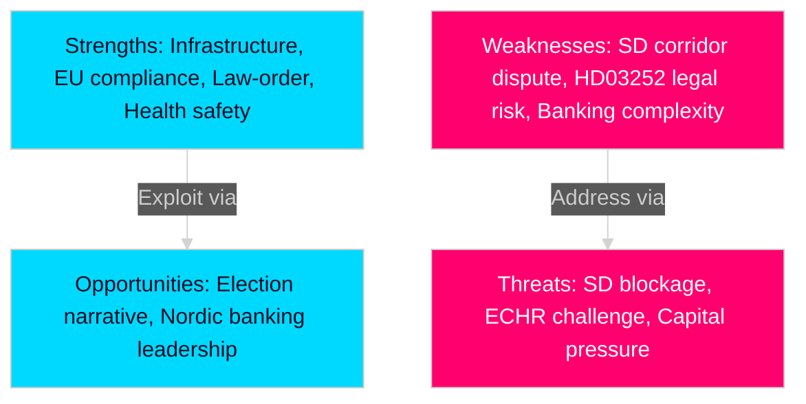

# SWOT Analysis — Swedish Government Propositions, 30 April 2026

**Author**: James Pether Sörling | **Run ID**: 25150587415

---

### Strengths

- **Historic infrastructure investment**: HD03259 commits 970 bn SEK — largest peacetime transport infrastructure plan in Swedish history. Evidence: HD03259 (riksdagen.se), Landsbygds- och infrastrukturdepartementet press release 24 April 2026. [A1]
- **EU regulatory compliance**: HD03253 completes Basel III transposition ahead of most peer member states, reducing regulatory arbitrage and signalling Swedish banking sector stability. Evidence: HD03253 (riksdagen.se), EU Regulation 2024/1623. [A2]
- **Law-and-order consistency**: HD03252 continues the Tidöalliansen's consistent 2022–2026 legislative programme on criminal justice reform. Evidence: HD03252 (riksdagen.se), predecessor HC03202 (HC03201) in 2024/25 session. [A2]
- **Healthcare patient safety**: HD03247 reduces risk of OTC medicine misuse through systematic pharmacist advisory requirements. Evidence: HD03247 (riksdagen.se). [A2]

### Weaknesses

- **Infrastructure allocation controversy**: HD03259's prioritisation of rail over roads in some southern regions risks antagonising SD base voters who historically favour road infrastructure. Evidence: HD03259 committee referral to TU; SD parliamentary statements on road investment 2025. [B2]
- **Social security restriction scope**: HD03252 applies to "kontrollerat boende" — a newer enforcement modality — but legal boundaries between house arrest and prison remain contested in jurisprudence. Evidence: HD03252 summary, SfU referral. [B2]
- **Banking package complexity**: HD03253's complexity (CRR3, CRD6, BRRD2 cross-references) risks implementation errors at Finansinspektionen. Evidence: HD03253 (riksdagen.se) — 253 cross-referencing articles. [B3]

### Opportunities

- **Infrastructure as election narrative**: HD03259 gives Kristersson a tangible 12-year legacy claim entering the autumn 2026 election campaign. Evidence: HD03259 (riksdagen.se), 970 bn SEK headline commitment. [A2]
- **Nordic banking leadership**: Sweden's early Basel III transposition via HD03253 positions Swedish banks (Swedbank, Handelsbanken, SEB, Nordea) as regulatory front-runners vs Danish and Norwegian peers. Evidence: HD03253 (riksdagen.se). [B2]
- **Cross-party OTC consensus**: HD03247 offers a low-controversy bipartisan win for health safety, broadening the government's appeal to S voters on healthcare. Evidence: HD03247 (riksdagen.se). [A2]

### Threats

- **SD corridor demands**: If SD refuses to support HD03259 as drafted, the government may need to renegotiate rail/road allocation, delaying the plan. Evidence: SD public statements on infrastructure Jan–Mar 2026; TU committee referral timeline. [B2]
- **Constitutional challenge to HD03252**: Restricting benefits for persons in "kontrollerat boende" may face ECHR Art. 8 (private life) and Art. 14 (non-discrimination) challenges. Evidence: HD03252 (riksdagen.se), Swedish Constitutional Committee (KU) scrutiny expected. [B2]
- **Banking sector capital pressure**: HD03253's stricter own-funds requirements may reduce Swedish bank lending capacity in a period of already-elevated interest rates. Evidence: HD03253 (riksdagen.se); ECB/EBA Q4 2025 banking sector report. [B3]

---

## TOWS Matrix

| | Strengths | Weaknesses |
|---|---|---|
| **Opportunities** | Use infrastructure investment (HD03259) as election centrepiece; fast-track banking compliance for Nordic leadership | Address SD rail/road balance concern early to prevent TU blockage |
| **Threats** | Constitutional robustness of HD03252 limits ECHR exposure; early cross-party wins on HD03247 build coalitions | Proactive Finansinspektionen guidance on HD03253 reduces implementation risk |

## Cross-SWOT Pattern

The April 2026 batch reveals a government using legislative momentum to lock in multi-year policy commitments before the election, with HD03259 as the flagship. The primary vulnerability is coalition management: SD's road-versus-rail preferences and the constitutional vulnerability of HD03252 are the top risk areas.

