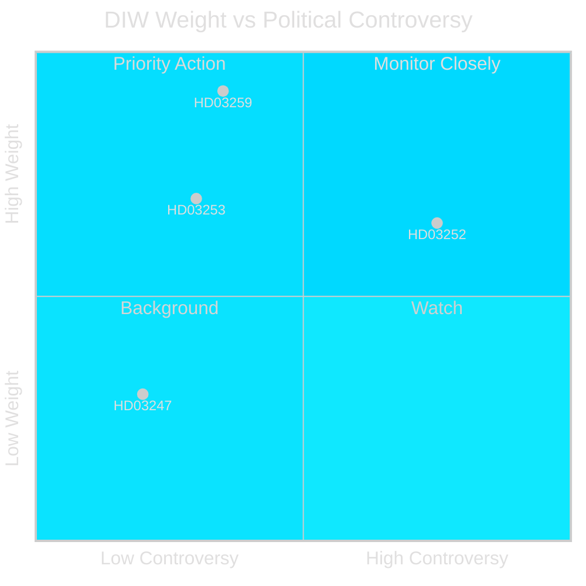
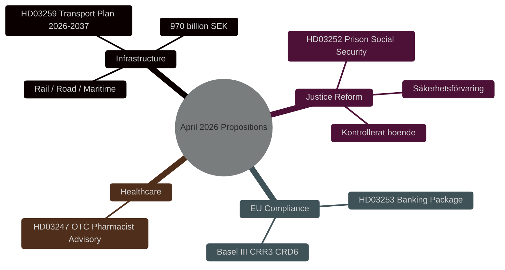

# Synthesis Summary — Swedish Government Propositions, 30 April 2026

**Author**: James Pether Sörling | **Date**: 2026-04-30 | **Run ID**: 25150587415

---

## Lead Story Decision

The National Transport Infrastructure Plan (HD03259) is the dominant event of this propositions cycle. At 970 billion SEK committed over 2026–2037, it represents the largest single peacetime infrastructure commitment in Swedish modern history. Its allocation logic — favouring rail maintenance and electrification over new road construction in the south, while investing heavily in Norrland connectivity — encodes strategic choices that will determine regional industrial competitiveness for a generation.

## DIW-Weighted Intelligence Picture

The four propositions span three policy clusters with distinct momentum:

**High weight (DIW L2+ Strategic)**: HD03259 (infrastructure) and HD03253 (EU banking) carry systemic consequences. The infrastructure plan shapes geography of economic activity; the banking package affects capital requirements for Swedish banks at a moment when EBA stress tests signal resilience concerns for mid-size EU institutions.

**Medium weight (DIW L2)**: HD03252 (social security restriction for sentenced persons) carries significant electoral signalling value ahead of the 2026 Riksdag election. The Tidöalliansen has advanced an escalating law-and-order legislative programme across 2024–2026; this proposition continues that trajectory.

**Lower weight (DIW L1)**: HD03247 (OTC pharmacist guidance) is technically important for patient safety but carries narrow political controversy.

## Integrated Intelligence Picture

The April 2026 propositions batch signals four strategic vectors of the Tidöalliansen government in its final legislative year before the September 2026 election:

1. **Infrastructure as legacy claim**: HD03259 frames the government's industrial and climate narrative — electric rail, Norrland, international freight corridors — designed to consolidate centre-right and rural/northern constituencies.

2. **Law-and-order escalation**: HD03252 is the latest in a sequence of propositions tightening the justice-social security nexus (see also HC03202, HC03201 from 2025). The pattern targets swing voters influenced by crime as a top-3 election issue.

3. **European regulatory integration**: HD03253 completes Sweden's Basel III transposition, aligning the Swedish banking sector with EU standards and reducing regulatory arbitrage risk. This is a technocratic delivery with low political controversy.

4. **Healthcare safety and patient protection**: HD03247 reflects health ministry attention to responsible self-medication in an ageing population context.

## Source Evidence

Primary sources: HD03259 (riksdagen.se), HD03252 (riksdagen.se), HD03253 (riksdagen.se), HD03247 (riksdagen.se). All documents submitted 2026-04-23 to 2026-04-28. MCP server: data.riksdagen.se via riksdag-regering MCP.
