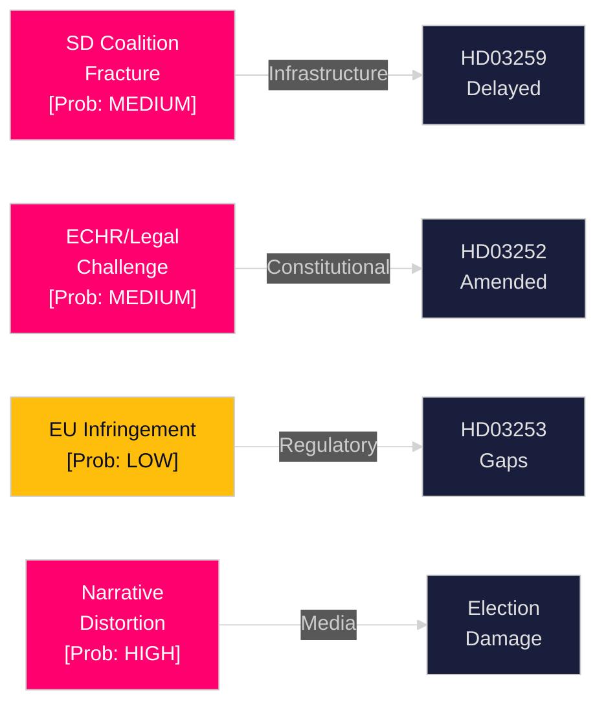

# Threat Analysis — Swedish Government Propositions, 30 April 2026

**Author**: James Pether Sörling | **Run ID**: 25150587415

---

## Threat Landscape

### Threat 1: Parliamentary Coalition Fracture (HD03259)

**Actor**: Sverigedemokraterna (SD)  
**Vector**: Parliamentary procedural — reservation in TU committee, alternative budget motion  
**Probability**: MEDIUM [B2]  
**Severity**: HIGH — delays or reshapes 970 bn SEK national infrastructure plan

SD has historically demanded higher road infrastructure allocation relative to rail. The 2026–2037 plan's strong rail emphasis (electrification, maintenance priority) may trigger SD demands for corridor rebalancing. Without SD's informal support, the Tidöalliansen minority government cannot pass the plan as submitted.

**Evidence**: HD03259 (riksdagen.se); SD transportation policy statements 2025; TU committee composition 2025/26.

### Threat 2: Legal/Constitutional Challenge (HD03252)

**Actor**: Social insurance recipients, NGOs, Justitieombudsmannen  
**Vector**: Legal — Lagrådet opinion, KU review, potential ECJ/ECtHR referral  
**Probability**: MEDIUM [B2]  
**Severity**: MEDIUM — legislation suspended or amended if Lagrådet finds fundamental rights violation

Restricting social insurance for persons in "kontrollerat boende" (electronic monitoring at home) — as opposed to traditional imprisonment — creates a legal grey zone: these persons are technically "in society" and may argue their private-life rights under ECHR Art. 8 are disproportionately restricted.

**Evidence**: HD03252 (riksdagen.se); ECHR Art. 8, Art. 14; Swedish constitutional practice on Lagrådet referrals.

### Threat 3: Regulatory Arbitrage Risk (HD03253)

**Actor**: EU Commission, EBA  
**Vector**: Supervisory — infringement proceedings if transposition incomplete  
**Probability**: LOW [B3]  
**Severity**: HIGH (systemic) — if Swedish banks exploit transposition gaps to maintain lower capital ratios

The EU Banking Package (CRR3/CRD6/BRRD2) introduces strict timelines. Member states that delay or incorrectly transpose face infringement proceedings and competitive advantage concerns.

**Evidence**: HD03253 (riksdagen.se); EU Regulation 2024/1623; EBA supervisory convergence guidelines.

### Threat 4: Disinformation / Opposition Narrative Distortion (HD03252)

**Actor**: Opposition parties (S, V, MP), social media  
**Vector**: Information environment — framing as "punishing poor prisoners"  
**Probability**: HIGH [A2]  
**Severity**: MEDIUM — narrative damage to government ahead of election

Left-wing opposition is likely to frame HD03252 as targeting economically vulnerable persons rather than addressing genuine abuses of social insurance. This framing, amplified through social media and union channels, could erode support among low-income swing voters.

**Evidence**: HD03252 (riksdagen.se); S party welfare policy platform 2025; Aftonbladet/Expressen coverage patterns on justice-welfare propositions.

## STRIDE Mapping (Political)

| Threat | STRIDE Category | Target |
|--------|----------------|--------|
| SD coalition fracture | Tampering — altering legislative outcome | Infrastructure plan integrity |
| Legal challenge | Elevation of privilege — judicial override of parliamentary decision | HD03252 legislative intent |
| EU infringement | Repudiation — non-compliance with EU obligations | Swedish banking regulatory framework |
| Narrative distortion | Spoofing — misrepresenting policy intent | Government communication on HD03252 |
