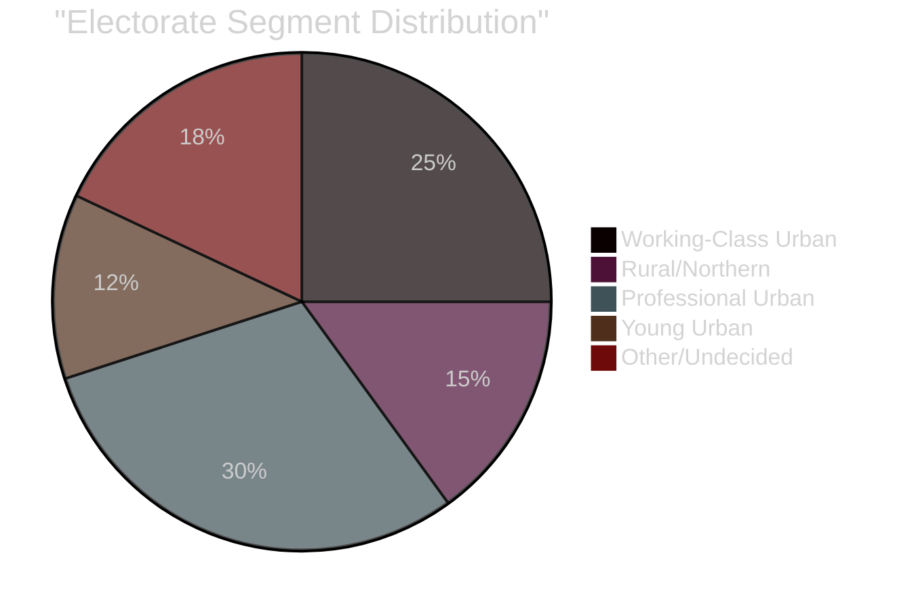

# Voter Segmentation — Swedish Government Propositions, 30 April 2026

**Author**: James Pether Sörling | **Run ID**: 25150587415

---

## Segment Analysis

### Segment 1: Working-Class Urban Voters (S/V base + SD competition zone)

**Size**: ~25% of electorate  
**Primary concern**: Living standards, crime, public service quality  
**Impact of April propositions**:
- HD03252 cuts benefits for sentenced persons — this segment includes both crime-affected communities (positive response to law-and-order) and economically vulnerable populations (negative response if family members affected)
- HD03259 infrastructure may benefit their region depending on corridor allocation
- **Net electoral effect**: Split; SD gains among crime-concerned, S/V gains among benefit-concerned

Evidence: HD03252 (riksdagen.se); SCB population statistics; Demoskop class-based polling data 2025.

### Segment 2: Rural and Northern Voters (C/S/SD competition zone)

**Size**: ~15% of electorate  
**Primary concern**: Infrastructure, rural services, cost of living  
**Impact**:
- HD03259 is the most relevant proposition for this segment — Norrland rail investment, road maintenance, port access
- If SD secures road corridor improvements, they gain in this segment at C's expense
- **Net electoral effect**: M/KD gain if infrastructure narrative sticks; SD gain if road demands are met

Evidence: HD03259 (riksdagen.se, Landsbygds- och infrastrukturdepartementet); Regional development data, SCB.

### Segment 3: Professional/Urban Middle Class (M/L/KD/C competition zone)

**Size**: ~30% of electorate  
**Primary concern**: Economic management, EU relations, education  
**Impact**:
- HD03253 (EU banking package) is most relevant — signals responsible EU integration and economic governance
- HD03259 supports this segment's interest in efficient transport for business travel and commuting
- HD03247 resonates with healthcare safety consciousness
- **Net electoral effect**: M/L/KD consolidation; marginal benefit from EU-aligned legislation

Evidence: HD03253 (riksdagen.se); Novus professional class polling.

### Segment 4: Young Urban Voters (MP/V/S competition zone)

**Size**: ~12% of electorate  
**Primary concern**: Climate, housing, inequality  
**Impact**:
- HD03259's climate dimension (electrification, reduced road dominance) partially appeals
- HD03252 strongly alienated — seen as punitive social policy
- **Net electoral effect**: Negative for government; V/MP gain on protest framing

Evidence: HD03252, HD03259 (riksdagen.se); Ungdomsbarometern political values data 2025.

