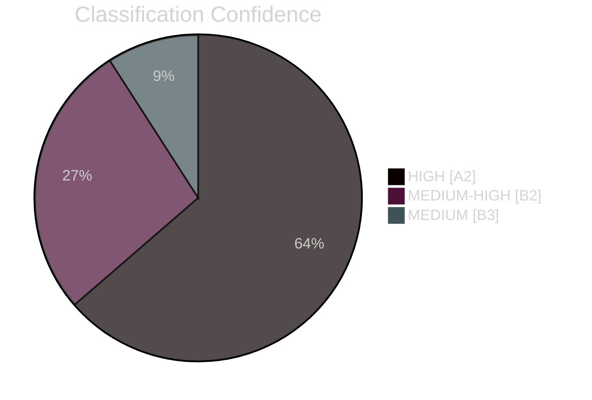

# Classification Results — Realtime Pulse 2026-04-30

**Author**: James Pether Sörling | **Date**: 2026-04-30 | **Confidence**: HIGH [A2]

---

## Document Classification Table

| DOK_ID | Titel (short) | Type | Organ | Domain | Cluster | Priority |
|--------|--------------|------|-------|--------|---------|----------|
| HD03251 | Integrated addiction-psychiatry care | Proposition | Socialdepartementet | Healthcare | Welfare reform | P1 |
| HD03254 | Military cooperation framework | Proposition | Försvarsdepartementet | Defence | Defence | P1 |
| HD03258 | Political transparency | Proposition | Justitiedepartementet | Governance | Anti-corruption | P1 |
| HD03260 | Research ethics | Proposition | Utbildningsdepartementet | Research | Regulatory | P2 |
| HD03263 | Return enforcement (biometric) | Proposition | Justitiedepartementet | Migration | Migration enforcement | P0 |
| HD03264 | Conduct requirements for residence permit | Proposition | Justitiedepartementet | Migration | Migration enforcement | P0 |
| HD03265 | Supervision/detention (migration) | Proposition | Justitiedepartementet | Migration | Migration enforcement | P0 |
| HD10460 | Interpellation: Cultural heritage | Interpellation | Kulturutskottet | Culture | Accountability | P2 |
| HD10461 | Interpellation: Space industry/ESA | Interpellation | Utrikesutskottet | Def/Space | Accountability | P2 |
| HD11768-HD11778 | Committee motions cluster | Motion | Multiple | Various | Legislative opposition | P2 |

## Cluster Analysis

### Cluster A — Migration Enforcement Trifecta (P0)
**Members**: HD03263, HD03264, HD03265
**Pattern**: Same department (Justitiedepartementet), same minister (Johan Forssell), same submission day (2026-04-30). Classic coordinated bundle — government submitting three interdependent bills as a package to Lagrådet simultaneously.
**Significance**: The coordination signal itself is intelligence — this was planned weeks in advance and coordinated at the highest level of the coalition.

### Cluster B — Defence & Governance (P1)
**Members**: HD03254, HD03258
**Pattern**: Cross-departmental, different ministers, same day. Suggests a pre-election "good governance" package alongside hard security measures.

### Cluster C — Welfare & Research (P1/P2)
**Members**: HD03251, HD03260
**Pattern**: Standalone but important for coalition balance (KD flagship welfare bill).

### Cluster D — Parliamentary Accountability (P2)
**Members**: HD10460, HD10461
**Pattern**: Interpellations target government responsibility on culture and space/defence policy.

## Confidence Assessment

