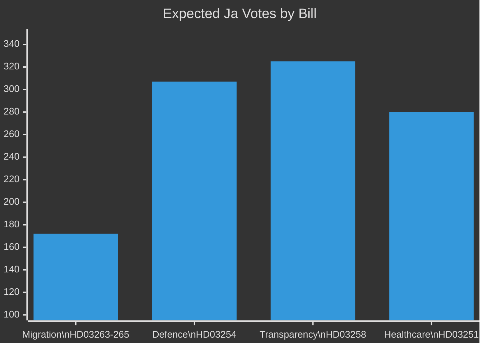

# Coalition Mathematics — Realtime Pulse 2026-04-30

**Author**: James Pether Sörling | **Date**: 2026-04-30 | **Confidence**: MEDIUM-HIGH [B2]

---

## Riksdag Seat Distribution (Current, 349 seats)

| Party | Seats | Coalition |
|-------|-------|-----------|
| Moderaterna (M) | 68 | Tidöalliansen |
| Sverigedemokraterna (SD) | 73 | Tidöalliansen |
| Kristdemokraterna (KD) | 19 | Tidöalliansen |
| Liberalerna (L) | 16 | Tidöalliansen |
| **Coalition total** | **176** | **Majority** |
| Socialdemokraterna (S) | 107 | Opposition |
| Centerpartiet (C) | 24 | Opposition (external) |
| Vänsterpartiet (V) | 24 | Opposition |
| Miljöpartiet (MP) | 18 | Opposition |
| **Opposition total** | **173** | |
| **Majority threshold** | **175** | |

## Bill-by-Bill Vote Mathematics

### HD03263-265 (Migration Enforcement Cluster)
| Party | Ja | Nej | Frånvarande | Expected |
|-------|-----|-----|-------------|---------|
| M | 68 | 0 | 0 | Full support |
| SD | 73 | 0 | 0 | Full support |
| KD | 19 | 0 | 0 | Full support |
| L | 12 | 0 | 4 | Partial — 4 may abstain on HD03265 |
| S | 0 | 107 | 0 | Full opposition |
| C | 0 | 20 | 4 | Mostly oppose with some abstentions |
| V | 0 | 24 | 0 | Full opposition |
| MP | 0 | 18 | 0 | Full opposition |
| **TOTALS** | **172** | **169** | **8** | **PASSES (narrow)** |

### HD03254 (Military Cooperation)
| Party | Ja | Nej | Frånvarande | Expected |
|-------|-----|-----|-------------|---------|
| M | 68 | 0 | 0 | |
| SD | 73 | 0 | 0 | |
| KD | 19 | 0 | 0 | |
| L | 16 | 0 | 0 | |
| S | 107 | 0 | 0 | Cross-party defence consensus |
| C | 24 | 0 | 0 | |
| V | 0 | 24 | 0 | Opposition |
| MP | 0 | 18 | 0 | Opposition |
| **TOTALS** | **307** | **42** | **0** | **PASSES (large majority)** |

### HD03258 (Political Transparency)
| Party | Ja | Nej | Frånvarande | Expected |
|-------|-----|-----|-------------|---------|
| Coalition (176) | 176 | 0 | 0 | Full support |
| S | 107 | 0 | 0 | Likely support with amendments |
| C | 24 | 0 | 0 | Likely support |
| V | 0 | 24 | 0 | May oppose (party finance concerns) |
| MP | 18 | 0 | 0 | Likely support |
| **TOTALS** | **325** | **24** | **0** | **PASSES (supermajority)** |

## Majority Risk Assessment

**Critical vulnerability**: HD03263-265 passes with 172 Ja if L holds (176) minus potential 4 abstentions = 172 vs 169 Nej — a 3-seat margin. Any 2 additional L defections would drop below 175 majority threshold.

