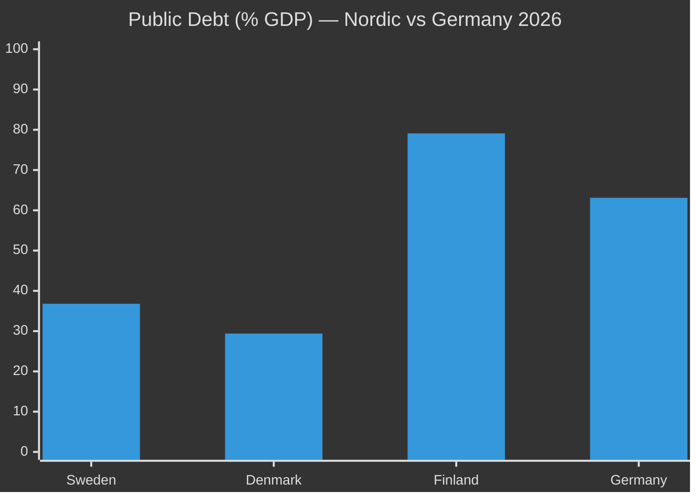

# Comparative International Analysis — Realtime Pulse 2026-04-30

**Author**: James Pether Sörling | **Date**: 2026-04-30 | **Confidence**: MEDIUM [B2]

---

## Comparator Table

| Dimension | Sweden 2026 | Denmark 2023-24 | Finland 2024 | Germany 2024-25 |
|-----------|-------------|-----------------|--------------|-----------------|
| Migration enforcement legislation | HD03263-265: return enforcement + conduct + detention trifecta | Barnets lov + Udlændingeloven amendments: similar return enforcement + benefit conditionality | Border control extension + rapid return reforms | Asylverfahrensbeschleunigungsgesetz (fast-track asylum) + Rückführungsverbesserungsgesetz |
| Defence cooperation | HD03254: military legal framework post-NATO accession | NATO member since 1949 — high interoperability baseline | Post-NATO bilateral defence MOU with Sweden 2024 | Bundeswehr Sondervermögen 100bn EUR special fund; NATO 2% GDP commitment |
| Political transparency | HD03258: party financing disclosure | Partifinansieringslov revised 2022 | Puoluetukijärjestelmä under reform 2024 | Parteiengesetz amendment 2023: enhanced disclosure |
| Economic context | IMF WEO 2026: GDP 2.1%, debt 36.8% GDP, fiscal balance -0.5% | IMF WEO 2026: GDP 2.3%, debt 29.4% GDP | IMF WEO 2026: GDP 1.8%, debt 79.1% GDP | IMF WEO 2026: GDP 0.2%, debt 63.1% GDP |

## Key Comparative Intelligence

### Migration: The Nordic Pattern
Sweden, Denmark, and Finland are all tightening migration enforcement simultaneously in an election-adjacent period. This represents a Nordic regional convergence on enforcement over integration — driven by the common factor of parliamentary right gaining leverage. Denmark's experience (2015-2023 S-government adoption of SD-equivalent migration policy) is the most direct comparator for Sweden's Tidöavtalet model.

**Danish indicator**: Denmark enacted return enforcement and benefit conditionality in 2022-2023 under S government without major ECHR challenge. This precedent strengthens the Swedish government's legal confidence on HD03263+264.

### Defence: NATO New-Member Pattern
Sweden's HD03254 closely mirrors Finland's 2023-2024 NATO-accession legislation adjusting national law for operational military cooperation. Finland completed its legislative package within 18 months of accession (2023-2024). Sweden is following the same pattern. **Inference**: HD03254 represents institutional compliance with a well-established NATO accession playbook.

### Fiscal Context (IMF)
Sweden's fiscal position (debt 36.8% GDP, fiscal balance -0.5%) is among the strongest in the EU. This gives the government fiscal space to implement the infrastructure bill (HD03259 from propositions) and the healthcare reforms (HD03251) without austerity trade-offs. Germany's much weaker fiscal position (debt 63.1% GDP, near-zero growth) contrasts sharply.

