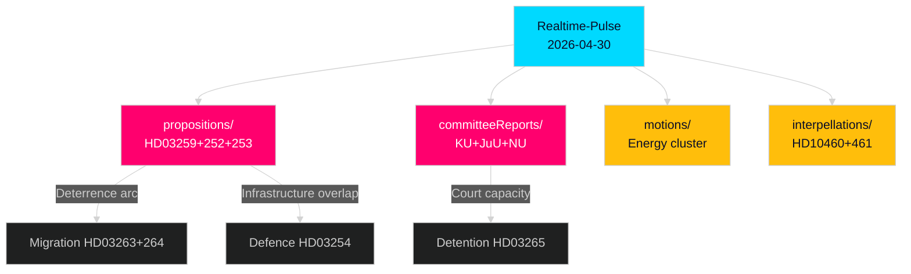

# Cross-Reference Map — Realtime Pulse 2026-04-30 (Tier-C Aggregation)

**Author**: James Pether Sörling | **Date**: 2026-04-30 | **Confidence**: HIGH [A2]
**Article Type**: Tier-C Realtime Pulse — cross-type synthesis required

---

## Sibling Folder References (Tier-C Required)

This Tier-C aggregation synthesises intelligence from all prior cycles for 2026-04-30:

| Sibling Cycle | Path | Key Themes | Compatibility |
|--------------|------|-----------|---------------|
| Propositions | `analysis/daily/2026-04-30/propositions/` | HD03259 (970bn infrastructure), HD03252 (prison benefits), HD03253 (EU banking) | HIGH — fiscal discipline + infrastructure context complements migration enforcement |
| Committee Reports | `analysis/daily/2026-04-30/committeeReports/` | KU digital integrity (HD01KU36), court reform (HD01JuU9), competition tools (HD01NU22) | HIGH — court reform directly relevant to migration detention legal framework |
| Motions | `analysis/daily/2026-04-30/motions/` | Energy transition cluster, permitting agency opposition | MEDIUM — environmental policy counterweight to government agenda |
| Interpellations | `analysis/daily/2026-04-30/interpellations/` | Cultural heritage (HD10460), space/ESA (HD10461) | LOW-MEDIUM — accountability vectors, different policy domain |

## Cross-Document Intelligence Links

### Link 1: HD03265 (Detention) ↔ HD01JuU9 (Court Reform) [committeeReports]
**Connection**: HD01JuU9 (court reform committee report) addresses administrative court capacity. HD03265 detention orders are adjudicated by administrative courts. Court reform directly affects the implementation speed and quality of migration detention decisions. **Inference**: Government may be betting that court reforms improve administrative capacity before HD03265 takes effect.

### Link 2: HD03259 (970bn Infrastructure) ↔ HD03254 (Defence Cooperation) [propositions]
**Connection**: HD03259 infrastructure proposition includes defence infrastructure components (roads, bridges with dual military-civilian use). HD03254 military cooperation requires infrastructure interoperability with NATO partners. These bills may share implementation dependencies at Trafikverket/Försvarsmakten interface. **Inference**: Integrated national-defence infrastructure investment signal.

### Link 3: HD03252 (Prison Benefits) ↔ HD03263+264 (Migration Enforcement) [propositions]
**Connection**: HD03252 (from propositions sibling) restricts prison benefits; HD03263+264 strengthen return enforcement and conduct requirements. Both form the government's "consequences" arc — criminal consequences (HD03252) + migration consequences (HD03263+264) sharing a common deterrence narrative. **Inference**: Coordinated messaging strategy for election campaign.

### Link 4: HD01NU22 (Competition Tools) ↔ HD03258 (Transparency) [committeeReports]
**Connection**: HD01NU22 (competition law committee report) and HD03258 (political transparency) both address power concentration — one in markets, one in politics. **Inference**: "Anti-corruption + pro-competition" good-governance package for swing voters.

## Conflict Flags

| Conflict | Documents | Type |
|----------|-----------|------|
| L (Liberal) ECHR concerns vs SD migration maximalism | HD03265 vs coalition dynamics | Intra-coalition friction |
| Infrastructure investment vs fiscal consolidation | HD03259 (propositions) vs IMF fiscal balance target | Fiscal policy tension |
| Court capacity vs migration detention volume | HD01JuU9 + HD03265 | Implementation constraint |

