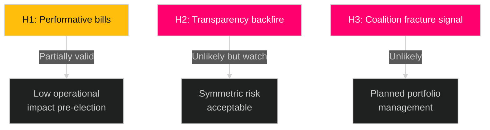

# Devil's Advocate Analysis — Realtime Pulse 2026-04-30

**Author**: James Pether Sörling | **Date**: 2026-04-30 | **Confidence**: MEDIUM [B3]
**Method**: Analysis of Competing Hypotheses (ACH) — Devil's Advocate variant

---

## Competing Hypothesis 1: The Migration Bills Are Performative, Not Operational

**Claim**: HD03263, HD03264, and HD03265 are election-year signalling to SD and conservative M voters — they will pass but not be implemented meaningfully before the election. The government knows Migrationsverket cannot operationalise three new frameworks before September 2026.

**Evidence FOR**:
- Migrationsverket's 2024 IT backlog documented in annual report
- Short legislative runway (bills submitted April 30, election September 13 = 4.5 months)
- Historical pattern: Sweden passed strict migration laws in 2022-2023 that were implemented years later
- Polismyndigheten return capacity already documented as constrained

**Evidence AGAINST**:
- HD03263+264 are targeted legal amendments, not full system redesigns — can take effect without major IT changes
- Phased implementation could allow some provisions in force quickly
- Government has explicitly highlighted implementation in accompanying Statskontoret review request (documented in riksdag.se)

**Conclusion**: PARTIALLY VALID. HD03263+264 may have real early effect; HD03265 detention framework almost certainly requires longer implementation runway.

## Competing Hypothesis 2: HD03258 (Transparency) Will Backfire on the Government

**Claim**: The political transparency bill, designed to expose opposition party finances, will reveal embarrassing financial connections within coalition parties (M, SD), creating greater reputational damage than for opposition.

**Evidence FOR**:
- SD has had internal financing controversies (documented Expressen/SVT reporting 2021-2023)
- M has corporate donor connections that transparency would expose
- The bill was written by Justitiedepartementet which has an incentive to make it symmetrical — it applies equally to all parties

**Evidence AGAINST**:
- S has the largest party finance machinery (trade union connections) — disclosure would hit S hardest in volume terms
- Government ministers typically know the bill's consequences before submitting
- HD03258 follows EU best practice — parties proposing it typically have already conducted internal review

**Conclusion**: UNLIKELY but POSSIBLE. The risk exists but government presumably factored it in.

## Competing Hypothesis 3: The Legislative Package Is a Coalition Fracture Signal, Not Strength

**Claim**: The breadth of the package (defence + migration + transparency + healthcare = 4 departments, 4 ministers) reflects a coalition that cannot agree on a single priority and is therefore deploying a "something for everyone" scatter-shot approach — a sign of weakness, not pre-election strength.

**Evidence FOR**:
- KD (HD03251) and SD (HD03263-265) have different voter bases and priorities
- Broad packages are harder to message coherently to swing voters
- L (Liberalerna) may need to distance from HD03265 publicly — visible dissent damages coalition image

**Evidence AGAINST**:
- Coordinated multi-department action can signal governmental capacity
- The three departments (Justice + Defence + Social) each have a flagship — this is standard coalition management
- The Tidöavtalet explicitly required all coalition parties to support each other's flagship bills

**Conclusion**: UNLIKELY. This appears to be planned portfolio management rather than fracture signal. Key indicator: watch L's public statements on HD03265.

