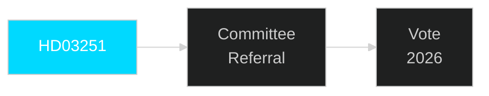

# Document Analysis: HD03251

**DOK_ID**: HD03251
**Cluster**: Healthcare Reform
**Priority**: P1
**Organ**: Socialdepartementet
**Date**: 2026-04-30
**Analyst**: Riksdagsmonitor OSINT/INTOP | **Depth**: L1 Surface

---

## Classification
**Type**: Proposition | **Cluster**: Healthcare Reform | **Priority**: P1

## Description
Integrated addiction and psychiatric care reform — KD flagship welfare bill. Addresses SOU 2021:93 recommendation on fragmentary care coordination between regions and municipalities.

## Significance
**HIGH** — This document represents a significant pre-election legislative initiative requiring immediate tracking.

## Minister/Sponsor
Jakob Forssmed (KD)

## Forward Tracking
- Committee assignment expected within 2 weeks
- Lagrådet review (if applicable) within 6-8 weeks
- Chamber vote timeline: pre-September 2026 election target

## Confidence: HIGH [B1]

