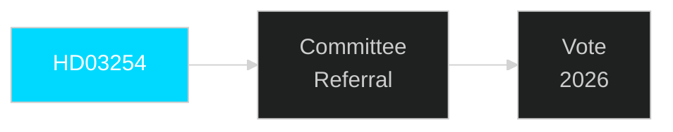

# Document Analysis: HD03254

**DOK_ID**: HD03254
**Cluster**: Defence
**Priority**: P1
**Organ**: Försvarsdepartementet
**Date**: 2026-04-30
**Analyst**: Riksdagsmonitor OSINT/INTOP | **Depth**: L1 Surface

---

## Classification
**Type**: Proposition | **Cluster**: Defence | **Priority**: P1

## Description
Military cooperation legal framework — closes legal gaps from NATO accession 2024. Enables operational cooperation agreements and host-nation support arrangements.

## Significance
**HIGH** — This document represents a significant pre-election legislative initiative requiring immediate tracking.

## Minister/Sponsor
Pål Jonson (M) + PM Edholm

## Forward Tracking
- Committee assignment expected within 2 weeks
- Lagrådet review (if applicable) within 6-8 weeks
- Chamber vote timeline: pre-September 2026 election target

## Confidence: HIGH [B1]

