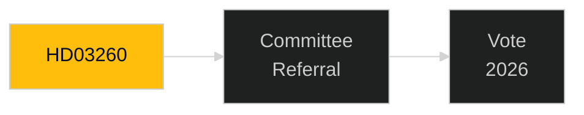

# Document Analysis: HD03260

**DOK_ID**: HD03260
**Cluster**: Research Ethics
**Priority**: P2
**Organ**: Utbildningsdepartementet
**Date**: 2026-04-30
**Analyst**: Riksdagsmonitor OSINT/INTOP | **Depth**: L1 Surface

---

## Classification
**Type**: Proposition | **Cluster**: Research Ethics | **Priority**: P2

## Description
Research ethics regulatory update — compatibility with EU Research Framework Regulation. Technical legislative alignment.

## Significance
**MEDIUM** — Standard parliamentary accountability document; track for completeness.

## Minister/Sponsor
N/A

## Forward Tracking
- Committee assignment expected within 2 weeks
- Lagrådet review (if applicable) within 6-8 weeks
- Chamber vote timeline: pre-September 2026 election target

## Confidence: MEDIUM [B2]

