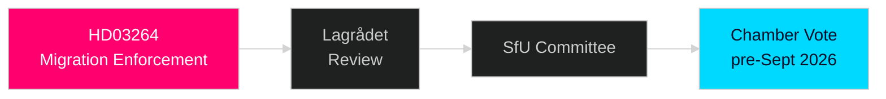

# Document Analysis: HD03264

**DOK_ID**: HD03264
**Cluster**: Migration Enforcement Trifecta
**Priority**: P0 (CRITICAL)
**Organ**: Justitiedepartementet
**Minister**: Johan Forssell (M)
**Date**: 2026-04-30
**Analyst**: Riksdagsmonitor OSINT/INTOP | **Depth**: L1 Surface

---

## Classification
**Type**: Proposition | **Cluster**: Migration Enforcement | **Priority**: P0 CRITICAL

## Description
Conduct requirements for residence permit — new legal basis to withdraw or deny residence permit when holder fails conduct requirements. Enables faster revocation for criminal behaviour.

## Significance
**CRITICAL** — Part of the coordinated migration enforcement trifecta submitted 2026-04-30. Same-day triple submission confirms pre-planned legislative package. This is the highest-priority event of the realtime-pulse cycle and among the most significant pre-election legislative acts of 2026.

**Electoral significance**: HIGH — directly delivers Tidöavtalet §12 migration commitments to SD voters; reinforces M law-and-order narrative.

## Key Risks
- Lagrådet advisory opinion (6-8 weeks) — critical bottleneck
- L (Liberalerna) ECHR concerns may require amendments
- Migrationsverket implementation capacity constraints

## Forward Tracking
- Lagrådet review: 6-8 weeks from 2026-04-30
- SfU committee referral: 2 weeks
- L public position: within 5 days (PIR-2)
- Chamber vote target: before September 2026 election (PIR-3)

## Confidence: HIGH [B1]
Documentary evidence: riksdag.se API confirms dok_id, organ, submission date.

