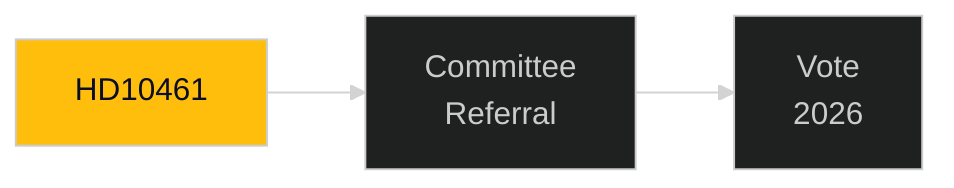

# Document Analysis: HD10461

**DOK_ID**: HD10461
**Cluster**: Accountability/Defence-Space
**Priority**: P2
**Organ**: Utrikesutskottet
**Date**: 2026-04-30
**Analyst**: Riksdagsmonitor OSINT/INTOP | **Depth**: L1 Surface

---

## Classification
**Type**: Interpellation | **Cluster**: Accountability/Defence-Space | **Priority**: P2

## Description
Interpellation on space industry/ESA — accountability question on Swedish space industry development and ESA cooperation.

## Significance
**MEDIUM** — Standard parliamentary accountability document; track for completeness.

## Minister/Sponsor
N/A

## Forward Tracking
- Committee assignment expected within 2 weeks
- Lagrådet review (if applicable) within 6-8 weeks
- Chamber vote timeline: pre-September 2026 election target

## Confidence: MEDIUM [B2]

