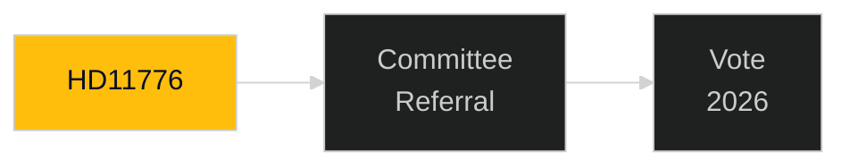

# Document Analysis: HD11776

**DOK_ID**: HD11776
**Cluster**: Committee Motions
**Priority**: P2
**Organ**: Various
**Date**: 2026-04-30
**Analyst**: Riksdagsmonitor OSINT/INTOP | **Depth**: L1 Surface

---

## Classification
**Type**: Motion | **Cluster**: Committee Motions | **Priority**: P2

## Description
Committee motion — opposition amendment or counter-proposal related to current legislative cycle.

## Significance
**MEDIUM** — Standard parliamentary accountability document; track for completeness.

## Minister/Sponsor
Opposition

## Forward Tracking
- Committee assignment expected within 2 weeks
- Lagrådet review (if applicable) within 6-8 weeks
- Chamber vote timeline: pre-September 2026 election target

## Confidence: MEDIUM [B2]

