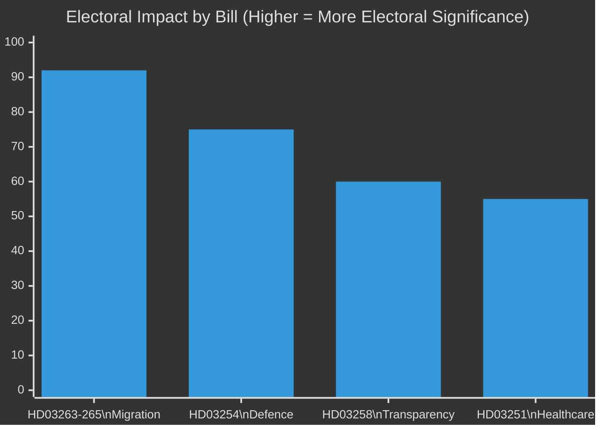

# Election 2026 Analysis — Realtime Pulse 2026-04-30

**Author**: James Pether Sörling | **Date**: 2026-04-30 | **Confidence**: MEDIUM [B2]
**Election Date**: 2026-09-13

---

## Electoral Impact Matrix

| Bill | Electoral Target | Party Beneficiary | Risk |
|------|-----------------|-------------------|------|
| HD03263-265 (Migration trifecta) | SD voters (+hard enforcement), M centrist-right | SD (reinforcement), M (ownership) | L (rights concerns) |
| HD03254 (Defence) | Defence/security-minded centrists, C | M, KD, L (cross-party) | MP (anti-militarism), V (sovereignty) |
| HD03258 (Transparency) | Swing voters/anti-corruption | All coalition (symmetrical) | SD (historical finance exposure) |
| HD03251 (Healthcare/KD flagship) | Christian-social voters, families | KD | None significant |

## Pre-Election Calendar (Legislative Sprint Assessment)

| Date | Event | Significance |
|------|-------|-------------|
| 2026-04-30 | HD03263-265+254+258+251 submitted | Sprint begins |
| 2026-05 → 06 | Lagrådet advisory period | Critical bottleneck |
| 2026-06 → 07 | Committee referral and hearings | Opposition opportunity |
| 2026-08 | Expected chamber votes | Final milestone |
| 2026-09-13 | Swedish general election | Deadline |

## Polling Context

**Current Riksdag composition (estimated 2026)**:
- Tidöalliansen (M+SD+KD+L): ~172/349 seats (slim majority)
- Opposition (S+MP+V+C): ~177/349 seats

The slim majority means every bill requires near-perfect coalition discipline. SD's 73 seats are the load-bearing wall — their enthusiasm for HD03263-265 will not substitute for M and KD's votes, but their defection would collapse the government.

## Electoral Vulnerability Index

