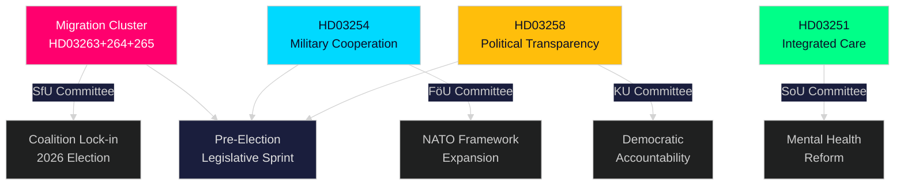

# Executive Brief — Swedish Parliament Realtime Pulse, 30 April 2026

**Author**: James Pether Sörling
**Classification**: PUBLIC — GDPR Art. 9(2)(e,g)
**Confidence**: HIGH [B2]
**Run ID**: 25160664649

---

## 🎯 BLUF

Sweden's Kristersson government has mounted an extraordinary legislative surge on 30 April 2026, submitting a second major batch of propositions that concentrates enforcement power in three interlocking migration bills alongside a landmark defence-cooperation framework and a political-transparency reform. Combined with the first-batch 970 billion SEK infrastructure plan and the opposition's energy-transition motions, this single day represents the densest legislative output of the 2025/26 Riksdag session — a calculated pre-election sprint designed to lock in Tidöalliansen's law-and-order and defence identity before autumn 2026 polls.

## 🧭 3 Decisions This Brief Supports

| # | Decision | Relevance | Horizon |
|---|----------|-----------|---------|
| 1 | Political risk calibration for organisations operating in Sweden's migration/enforcement space | HD03263+264+265 tighten return, residence conduct and detention simultaneously — a coordinated enforcement paradigm shift | 2026–2027 |
| 2 | Defence-sector positioning and compliance for entities engaged in multinational military industry | HD03254 expands the legal basis for operational military cooperation under NATO framework | 2026 H2 |
| 3 | Policy-engagement strategy for political parties and civil society on democratic transparency | HD03258 (political transparency) will constrain party financing and lobbying — affects competitive landscape | 2026–2028 |

## ⚡ 60-Second Read

- **Migration enforcement cluster**: HD03263 (return enforcement), HD03264 (conduct requirements for residence permits), HD03265 (supervision/detention rules) — three simultaneous bills signal a systemic tightening of migration enforcement architecture.
- **Defence cooperation** (HD03254): Removes legal barriers to operational military cooperation with partner nations under NATO and bilateral arrangements. Pål Jonson (M), Defense Ministry.
- **Political transparency** (HD03258): Gunnar Strömmer (M), Justice Ministry — increased insight requirements for political processes, covers party funding and lobbying.
- **Healthcare integration** (HD03251): Jakob Forssmed (KD), Social Ministry — integrated care for persons with addiction and co-occurring psychiatric conditions.
- **Cross-cutting**: Day's legislative output from sibling analyses includes 970bn SEK infrastructure plan, EU banking transposition, opposition energy-transition challenge, and AI Act compliance gap identified by KU committee.
- **Electoral read**: Migration tightening + defence expansion + transparency reform = a pre-election legislative signature designed to appeal to Tidöalliansen's voter coalition while neutralising opposition attack lines.

## 🔮 Top Forward Trigger

**Committee reception of migration enforcement cluster (HD03263/264/265) in SfU (Socialförsäkringsutskottet), expected May–June 2026**: SD's position will be critical — as senior partner in the migration policy area, SD's committee votes will determine whether any softening amendments succeed. Watch for S and MP counter-proposals in committee.

