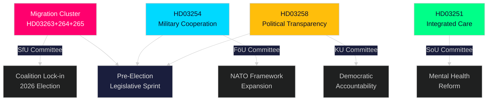

<!-- rtl -->
# ملخص تنفيذي — النبض اللحظي للبرلمان السويدي، 30 أبريل 2026

**Author**: James Pether Sörling
**Classification**: PUBLIC — GDPR Art. 9(2)(e,g)
**Confidence**: HIGH [B2]
**Run ID**: 25160664649

---

## 🎯 الخلاصة التنفيذية

شنّت حكومة كريسترسون في الثلاثين من أبريل 2026 موجةً تشريعيةً استثنائية، وقدّمت حزمةً ثانيةً كبيرةً من الاقتراحات تركّز صلاحيات التنفيذ في ثلاثة مشاريع قوانين هجرة مترابطة، إلى جانب إطارٍ رائدٍ للتعاون الدفاعي وإصلاحٍ للشفافية السياسية. ويُمثّل هذا اليوم الواحد — مقروناً بخطة البنية التحتية البالغة 970 مليار كرونة سويدية من الحزمة الأولى ومقترحات المعارضة بشأن التحوّل في مجال الطاقة — أعلى كثافةٍ تشريعيةٍ في دورة البرلمان 2025/26، وهو عبارة عن اندفاعةٍ محسوبةٍ قبل الانتخابات لتثبيت هوية تحالف تيدو في مجال القانون والنظام والدفاع قبل انتخابات خريف 2026.

## 🧭 ثلاثة قرارات يدعمها هذا الملخص

| # | القرار | الصلة | الأفق الزمني |
|---|--------|-------|--------------|
| 1 | معايرة المخاطر السياسية للمنظمات العاملة في مجال الهجرة والتنفيذ في السويد | HD03263+264+265 تُشدّد الإعادة والسلوك السكني والاحتجاز في آنٍ واحد — تحوّل منسّق في بنية التنفيذ | 2026–2027 |
| 2 | التموضع الدفاعي والامتثال للجهات الفاعلة في الصناعة العسكرية متعددة الجنسيات | HD03254 يوسّع الأساس القانوني للتعاون العسكري العملياتي في إطار حلف الناتو | النصف الثاني من 2026 |
| 3 | استراتيجية المشاركة السياسية للأحزاب والمجتمع المدني بشأن الشفافية الديمقراطية | HD03258 (الشفافية السياسية) سيقيّد تمويل الأحزاب والضغط — يؤثر على المشهد التنافسي | 2026–2028 |

## ⚡ قراءة في 60 ثانية

- **حزمة تنفيذ الهجرة**: HD03263 (تنفيذ الإعادة)، HD03264 (اشتراطات السلوك لتصاريح الإقامة)، HD03265 (قواعد الإشراف/الاحتجاز) — ثلاثة قوانين متزامنة تُشير إلى تشديدٍ منهجي لبنية تنفيذ الهجرة.
- **التعاون الدفاعي** (HD03254): يُزيل العقبات القانونية أمام التعاون العسكري العملياتي مع الدول الشريكة في إطار الناتو والترتيبات الثنائية. Pål Jonson (M)، وزارة الدفاع.
- **الشفافية السياسية** (HD03258): Gunnar Strömmer (M)، وزارة العدل — اشتراطات إفصاحٍ مُعزَّزة في العمليات السياسية، تشمل تمويل الأحزاب وأنشطة الضغط.
- **التكامل الصحي** (HD03251): Jakob Forssmed (KD)، وزارة الشؤون الاجتماعية — رعاية متكاملة للأشخاص المصابين بالإدمان والاضطرابات النفسية المصاحبة.
- **التقاطع**: يشمل الناتج التشريعي لهذا اليوم من التحليلات الشقيقة: خطة البنية التحتية البالغة 970 مليار كرونة، وتحويل قانون البنوك الأوروبي، وتحدي التحوّل في الطاقة للمعارضة، وثغرة الامتثال لقانون الذكاء الاصطناعي التي رصدتها لجنة KU.
- **القراءة الانتخابية**: تشديد الهجرة + توسيع الدفاع + إصلاح الشفافية = بصمةٌ تشريعية قبل الانتخابات مُصمَّمة لاستقطاب ائتلاف ناخبي تيدو وتحييد خطوط هجوم المعارضة.

## 🔮 أبرز المحفّزات المستقبلية

**استقبال لجنة تنفيذ الهجرة (HD03263/264/265) في SfU (Socialförsäkringsutskottet)، متوقّع في مايو–يونيو 2026**: سيكون موقف SD حاسماً — بوصفه الشريك الأوّل في مجال سياسة الهجرة، ستحدّد تصويتات SD في اللجنة مدى نجاح أي تعديلات تخفيفية. تابعوا المقترحات المضادة من S وMP في اللجنة.

<!-- source-sha: 4982fc0535678625b509068942c6e0e28c6416e6 -->
