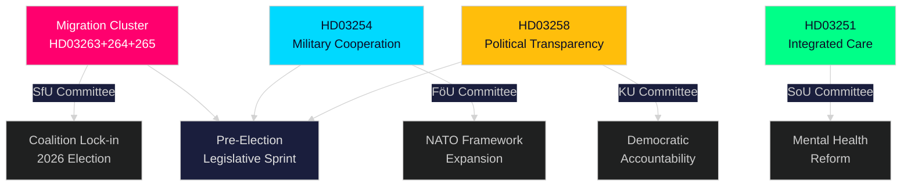

# Eksekutiv Orientering — Rigsdagens Realtidspuls, 30. april 2026

**Author**: James Pether Sörling
**Classification**: PUBLIC — GDPR Art. 9(2)(e,g)
**Confidence**: HIGH [B2]
**Run ID**: 25160664649

---

## 🎯 BLUF

Kristersson-regeringen har gennemført en ekstraordinær lovgivningssurge den 30. april 2026 og indsendt en anden stor propositionspakke, der koncentrerer håndhævelsesmagt i tre sammenkoblede migrationslovgivninger ved siden af en banebrydende ramme for forsvarssamarbejde og en politisk transparensreform. Kombineret med den første pakkes infrastrukturplan på 970 milliarder SEK og oppositionens energiomstillingsforslagstillinger repræsenterer denne enkelt dag den tætteste lovgivningsproduktion i 2025/26 Riksdag-sessionen — en beregnet valgkampssprint designet til at låse Tidöalliansens lov-og-orden og forsvarsidentitet fast inden efterårets valg 2026.

## 🧭 3 Beslutninger som dette orientering understøtter

| # | Beslutning | Relevans | Horisont |
|---|-----------|----------|----------|
| 1 | Politisk risikokalibrering for organisationer, der opererer i Sveriges migrations-/håndhævelsesrum | HD03263+264+265 stramme returnering, bopælsadfærd og tilbageholdelse simultant — et koordineret paradigmeskift inden for håndhævelsesarkitekturen | 2026–2027 |
| 2 | Forsvarspositionering og compliance for aktører inden for multinational militærindustri | HD03254 udvider det juridiske grundlag for operativt militært samarbejde under NATO-rammen | 2026 H2 |
| 3 | Politisk engagementsstrategi for partier og civilsamfund om demokratisk transparens | HD03258 (politisk transparens) vil begrænse partifinansering og lobbyisme — påvirker det konkurrencemæssige landskab | 2026–2028 |

## ⚡ 60-sekunders læsning

- **Migrationshåndhævelsesklynge**: HD03263 (returhåndhævelse), HD03264 (adfærdskrav for opholdstilladelse), HD03265 (tilsyns-/tilbageholdelsesregler) — tre simultane lovgivninger signalerer en systemisk stramning af migrationshåndhævelsesarkitekturen.
- **Forsvarssamarbejde** (HD03254): Fjerner juridiske barrierer for operativt militært samarbejde med partnernationer under NATO og bilaterale arrangementer. Pål Jonson (M), Forsvarsministeriet.
- **Politisk transparens** (HD03258): Gunnar Strömmer (M), Justitsministeriet — øgede indsigtsrettigheder i politiske processer, dækker partifinansering og lobbyisme.
- **Sundhedsintegration** (HD03251): Jakob Forssmed (KD), Socialministeriet — integreret pleje for personer med afhængighed og samtidige psykiatriske tilstande.
- **Tværgående**: Dagens lovgivningsoutput fra søsteranalyser inkluderer 970 mia. SEK infrastrukturplan, EU-banktransponering, oppositionens energiomstillingsudfordring og AI Act-overholdelsesgab identificeret af KU.
- **Valglæsning**: Migrationsstramning + forsvarsudvidelse + transparensreform = en forvalgssignatur designet til at appellere til Tidöalliansens vælgerkoalition og neutralisere oppositionens angrebslinjer.

## 🔮 Topfremadudløser

**Udvalgsmodtagelse af migrationshåndhævelsesklyngen (HD03263/264/265) i SfU (Socialförsäkringsutskottet), forventet maj–juni 2026**: SD's position vil være afgørende — som ledende partner inden for migrationspolitikområdet vil SD's udvalgsafstemninger afgøre, om eventuelle lempende ændringer lykkes. Overvåg S og MP's modforslag i udvalget.

<!-- source-sha: 4982fc0535678625b509068942c6e0e28c6416e6 -->
