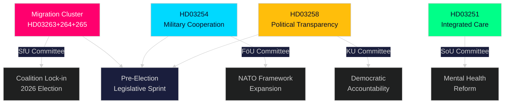

# Kurzfassung — Echtzeit-Puls des Reichstags, 30. April 2026

**Author**: James Pether Sörling
**Classification**: PUBLIC — GDPR Art. 9(2)(e,g)
**Confidence**: HIGH [B2]
**Run ID**: 25160664649

---

## 🎯 BLUF

Die Kristersson-Regierung hat am 30. April 2026 einen außergewöhnlichen Gesetzgebungsschub vollzogen und ein zweites großes Propositionspaket eingereicht, das die Vollzugsmacht in drei miteinander verknüpften Migrationsgesetzen bündelt — flankiert von einem wegweisenden Rahmenwerk für Verteidigungskooperation und einer Reform zur politischen Transparenz. Kombiniert mit dem 970-Milliarden-SEK-Infrastrukturplan des ersten Pakets und den Energiewende-Anträgen der Opposition stellt dieser einzelne Tag die dichteste Gesetzgebungsproduktion der Riksdag-Sitzungsperiode 2025/26 dar — ein kalkulierter Vorwahlsprint zur Festigung der Recht-und-Ordnungs- und Verteidigungs-Identität der Tidöalliansen vor den Herbstwahlen 2026.

## 🧭 3 Entscheidungen, die diese Kurzfassung unterstützt

| # | Entscheidung | Relevanz | Zeithorizont |
|---|-------------|----------|--------------|
| 1 | Politische Risikokalibrierung für Organisationen im schwedischen Migrations-/Vollzugsbereich | HD03263+264+265 verschärfen Rückkehr, Aufenthaltsverhalten und Inhaftierung simultan — ein koordinierter Paradigmenwechsel in der Vollzugsarchitektur | 2026–2027 |
| 2 | Verteidigungspositionierung und Compliance für Akteure in der multinationalen Militärindustrie | HD03254 erweitert die Rechtsgrundlage für operative Militärkooperation im NATO-Rahmen | 2026 H2 |
| 3 | Politische Engagementstrategie für Parteien und Zivilgesellschaft zur demokratischen Transparenz | HD03258 (politische Transparenz) wird Parteienfinanzierung und Lobbying einschränken — beeinflusst die Wettbewerbslandschaft | 2026–2028 |

## ⚡ 60-Sekunden-Lektüre

- **Migrationsvollzugscluster**: HD03263 (Rückkehrvollzug), HD03264 (Verhaltensanforderungen für Aufenthaltserlaubnisse), HD03265 (Überwachungs-/Haftregeln) — drei simultane Gesetze signalisieren eine systemische Verschärfung der Migrationsvollzugsarchitektur.
- **Verteidigungskooperation** (HD03254): Beseitigt rechtliche Hindernisse für operative Militärkooperation mit Partnernationen im Rahmen von NATO und bilateralen Vereinbarungen. Pål Jonson (M), Verteidigungsministerium.
- **Politische Transparenz** (HD03258): Gunnar Strömmer (M), Justizministerium — erhöhte Einsichtsrechte in politische Prozesse, umfasst Parteienfinanzierung und Lobbying.
- **Gesundheitsintegration** (HD03251): Jakob Forssmed (KD), Sozialministerium — integrierte Versorgung für Personen mit Sucht und gleichzeitig bestehenden psychiatrischen Erkrankungen.
- **Querschnittlich**: Die heutige Gesetzgebungsproduktion aus Schwesteranalysen umfasst den 970-Mrd.-SEK-Infrastrukturplan, EU-Banktransposition, die Energiewende-Herausforderung der Opposition und eine vom KU-Ausschuss identifizierte KI-Regulierungslücke.
- **Wahllektüre**: Migrationsstraffung + Verteidigungsexpansion + Transparenzreform = eine Vorwahl-Gesetzgebungssignatur zur Stärkung der Tidöalliansen-Wählerkoalition und Neutralisierung oppositioneller Angriffspunkte.

## 🔮 Wichtigster Vorwärtsauslöser

**Ausschussbehandlung des Migrationsvollzugsclusters (HD03263/264/265) im SfU (Socialförsäkringsutskottet), erwartet Mai–Juni 2026**: SD's Position wird entscheidend sein — als führender Partner im Migrationspolitikbereich werden SD's Ausschussabstimmungen darüber entscheiden, ob etwaige Abmilderungsänderungen Erfolg haben. Beobachten Sie S und MP's Gegenvorschläge im Ausschuss.

<!-- source-sha: 4982fc0535678625b509068942c6e0e28c6416e6 -->
