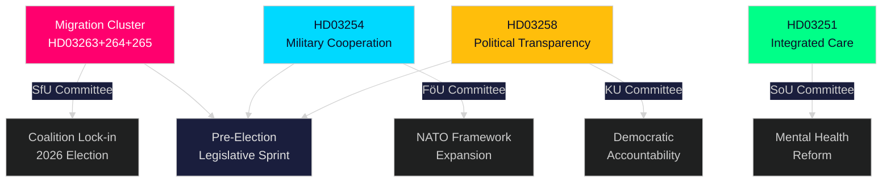

# Resumen ejecutivo — Pulso en tiempo real del Riksdag, 30 de abril de 2026

**Author**: James Pether Sörling
**Classification**: PUBLIC — GDPR Art. 9(2)(e,g)
**Confidence**: HIGH [B2]
**Run ID**: 25160664649

---

## 🎯 BLUF

El gobierno Kristersson ha protagonizado una extraordinaria oleada legislativa el 30 de abril de 2026, presentando un segundo gran paquete de proposiciones que concentra el poder ejecutivo en tres proyectos de ley migratorios interconectados, junto con un innovador marco de cooperación defensiva y una reforma de transparencia política. Combinado con el plan de infraestructura de 970 mil millones de SEK del primer paquete y las mociones de transición energética de la oposición, este único día representa la producción legislativa más densa de la sesión parlamentaria 2025/26 — un calculado sprint preelectoral diseñado para consolidar la identidad de ley y orden y defensa de la Tidöallians antes de las elecciones de otoño de 2026.

## 🧭 3 decisiones que respalda este resumen

| # | Decisión | Relevancia | Horizonte |
|---|---------|------------|-----------|
| 1 | Calibración del riesgo político para organizaciones que operan en el espacio de migración/aplicación de Suecia | HD03263+264+265 endurecen simultáneamente el retorno, la conducta residencial y la detención — un cambio de paradigma coordinado en la arquitectura de aplicación | 2026–2027 |
| 2 | Posicionamiento defensivo y cumplimiento para actores en la industria militar multinacional | HD03254 amplía la base jurídica para la cooperación militar operativa en el marco de la OTAN | 2026 S2 |
| 3 | Estrategia de compromiso político para partidos y sociedad civil sobre transparencia democrática | HD03258 (transparencia política) restringirá la financiación de partidos y el lobbying — afecta al panorama competitivo | 2026–2028 |

## ⚡ Lectura de 60 segundos

- **Clúster de aplicación migratoria**: HD03263 (aplicación del retorno), HD03264 (requisitos de conducta para permisos de residencia), HD03265 (normas de supervisión/detención) — tres leyes simultáneas señalan un endurecimiento sistémico de la arquitectura de aplicación migratoria.
- **Cooperación defensiva** (HD03254): Elimina barreras jurídicas para la cooperación militar operativa con naciones asociadas en el marco de la OTAN y acuerdos bilaterales. Pål Jonson (M), Ministerio de Defensa.
- **Transparencia política** (HD03258): Gunnar Strömmer (M), Ministerio de Justicia — mayores requisitos de transparencia en los procesos políticos, abarca la financiación de partidos y el lobbying.
- **Integración sanitaria** (HD03251): Jakob Forssmed (KD), Ministerio de Asuntos Sociales — atención integrada para personas con adicción y trastornos psiquiátricos concurrentes.
- **Transversal**: La producción legislativa del día de análisis relacionados incluye el plan de infraestructura de 970 000 millones de SEK, transposición bancaria de la UE, el desafío de transición energética de la oposición y una brecha de cumplimiento de la Ley de IA identificada por el comité KU.
- **Lectura electoral**: Endurecimiento migratorio + expansión defensiva + reforma de transparencia = una firma legislativa preelectoral diseñada para apelar a la coalición electoral de la Tidöallians y neutralizar las líneas de ataque de la oposición.

## 🔮 Principal desencadenante prospectivo

**Recepción en comité del clúster de aplicación migratoria (HD03263/264/265) en el SfU (Socialförsäkringsutskottet), prevista mayo–junio de 2026**: La posición del SD será determinante — como socio principal en el ámbito de la política migratoria, los votos del SD en comité decidirán si prosperan las posibles enmiendas de moderación. Seguir las contrapropuestas de S y MP en el comité.

<!-- source-sha: 4982fc0535678625b509068942c6e0e28c6416e6 -->
