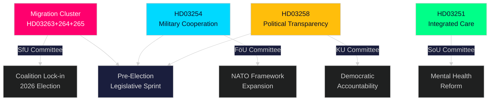

# Tiivistelmä — Riksdagin reaaliaikapulssi, 30. huhtikuuta 2026

**Author**: James Pether Sörling
**Classification**: PUBLIC — GDPR Art. 9(2)(e,g)
**Confidence**: HIGH [B2]
**Run ID**: 25160664649

---

## 🎯 BLUF

Kristersson-hallitus on toteuttanut poikkeuksellisen lainsäädäntörynnäkön 30. huhtikuuta 2026 ja jättänyt toisen suuren hallitusesityspaketin, joka keskittää täytäntöönpanovallan kolmeen toisiinsa linkitettyyn maahanmuuttolakiin yhdessä maanpuolustusyhteistyön puitesopimuksen ja poliittisen läpinäkyvyysuudistuksen kanssa. Yhdistettynä ensimmäisen paketin 970 miljardin SEK:n infrastrukturisuunnitelmaan ja opposition energiasiirtymäaloitteisiin tämä yksittäinen päivä edustaa 2025/26 Riksdagin istuntokauden tiheintä lainsäädäntötuotantoa — laskelmoitu vaalikampanjakiri, jolla pyritään lukitsemaan Tidöalliansens laki- ja järjestys- sekä puolustusidentiteetti ennen syksyn 2026 vaaleja.

## 🧭 3 päätöstä, joita tämä yhteenveto tukee

| # | Päätös | Merkitys | Aikajänne |
|---|--------|----------|-----------|
| 1 | Poliittinen riskikalibrointi organisaatioille, jotka toimivat Ruotsin maahanmuutto-/täytäntöönpanotilassa | HD03263+264+265 tiukentavat samanaikaisesti palautusta, asumiskäyttäytymistä ja säilöönottoa — koordinoitu muutos täytäntöönpanoarkkitehtuurissa | 2026–2027 |
| 2 | Puolustusasemointi ja vaatimustenmukaisuus monikansallisessa puolusteteollisuudessa toimiville | HD03254 laajentaa operatiivisen sotilasyhteistyön oikeusperustaa NATO-kehyksen alla | 2026 H2 |
| 3 | Poliittinen vaikuttamisstrategia puolueille ja kansalaisyhteiskunnalle demokraattisesta läpinäkyvyydestä | HD03258 (poliittinen läpinäkyvyys) rajoittaa puoluerahoitusta ja lobbausta — vaikuttaa kilpailutilanteeseen | 2026–2028 |

## ⚡ 60 sekunnin lukeminen

- **Maahanmuuton täytäntöönpanoryväs**: HD03263 (palautuksen täytäntöönpano), HD03264 (käyttäytymisvaatimukset oleskeluluville), HD03265 (valvonta-/säilöönottosäännöt) — kolme samanaikaista lakia signaloivat maahanmuuton täytäntöönpanoarkkitehtuurin järjestelmällistä tiukentamista.
- **Puolustusyhteistyö** (HD03254): Poistaa operatiivisen sotilasyhteistyön juridiset esteet NATO:n ja kahdenvälisten järjestelyjen puitteissa toimivien kumppanimaiden kanssa. Pål Jonson (M), Puolustusministeriö.
- **Poliittinen läpinäkyvyys** (HD03258): Gunnar Strömmer (M), Oikeusministeriö — lisätään näkyvyysvaatimuksia poliittisissa prosesseissa, kattaa puoluerahoituksen ja lobbauksen.
- **Terveydenhuoltointegraatio** (HD03251): Jakob Forssmed (KD), Sosiaaliministeriö — integroitu hoito päihderiippuvaisille, joilla on samanaikaisia psykiatrisia tiloja.
- **Poikkileikkaava**: Päivän lainsäädäntötuotanto sisarsisältöanalyyseistä käsittää 970 mrd. SEK:n infrastruktuurisuunnitelman, EU-pankkitranspositio, opposition energiasiirtymähaasteen sekä KU:n tunnistaman tekoälylain noudattamisaukon.
- **Vaaliluenta**: Maahanmuuton tiukentaminen + puolustuksen laajentaminen + läpinäkyvyysuudistus = vaalienneskirjoitus, jolla pyritään vetoamaan Tidöalliansens äänestäjäkoalitioon ja neutralisoimaan opposition hyökkäyslinjat.

## 🔮 Tärkein tulevaisuuden laukaisija

**Maahanmuuton täytäntöönpanoryväksen (HD03263/264/265) vastaanotto SfU:ssa (Socialförsäkringsutskottet), odotettavissa touko–kesäkuu 2026**: SD:n kanta on ratkaiseva — maahanmuuttopolitiikan alueella johtavana kumppanina SD:n valiokuntaäänestykset ratkaisevat, onnistuvatko mahdolliset pehmentämismuutokset. Seuraa S:n ja MP:n vastaesityksiä valiokunnassa.

<!-- source-sha: 4982fc0535678625b509068942c6e0e28c6416e6 -->
