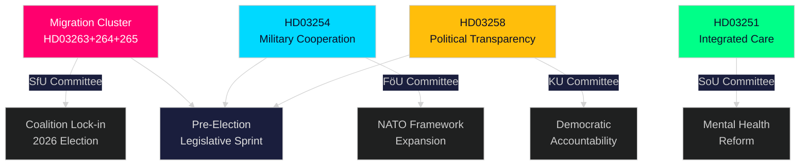

# Note de synthèse — Pulsation en temps réel du Riksdag, 30 avril 2026

**Author**: James Pether Sörling
**Classification**: PUBLIC — GDPR Art. 9(2)(e,g)
**Confidence**: HIGH [B2]
**Run ID**: 25160664649

---

## 🎯 BLUF

Le gouvernement Kristersson a réalisé une poussée législative extraordinaire le 30 avril 2026, soumettant un second grand paquet de propositions qui concentre le pouvoir exécutif dans trois textes migratoires interconnectés, ainsi qu'un cadre novateur de coopération défensive et une réforme de la transparence politique. Combiné au plan d'infrastructure de 970 milliards de SEK du premier paquet et aux motions de transition énergétique de l'opposition, cette seule journée représente la production législative la plus dense de la session parlementaire 2025/26 — un sprint pré-électoral calculé visant à consolider l'identité sécuritaire et défensive de la Tidöallians avant les élections d'automne 2026.

## 🧭 3 décisions que cette note appuie

| # | Décision | Pertinence | Horizon |
|---|---------|------------|---------|
| 1 | Calibrage du risque politique pour les organisations opérant dans l'espace migration/application suédois | HD03263+264+265 renforcent simultanément le retour, la conduite résidentielle et la détention — un changement de paradigme coordonné dans l'architecture d'application | 2026–2027 |
| 2 | Positionnement défensif et conformité pour les acteurs de l'industrie militaire multinationale | HD03254 élargit la base juridique de la coopération militaire opérationnelle dans le cadre de l'OTAN | 2026 S2 |
| 3 | Stratégie d'engagement politique pour les partis et la société civile sur la transparence démocratique | HD03258 (transparence politique) limitera le financement des partis et le lobbying — affecte le paysage concurrentiel | 2026–2028 |

## ⚡ Lecture en 60 secondes

- **Groupe d'application migratoire** : HD03263 (application du retour), HD03264 (conditions de comportement pour les titres de séjour), HD03265 (règles de supervision/détention) — trois textes simultanés signalent un resserrement systémique de l'architecture d'application migratoire.
- **Coopération défensive** (HD03254) : Supprime les obstacles juridiques à la coopération militaire opérationnelle avec les nations partenaires dans le cadre de l'OTAN et des arrangements bilatéraux. Pål Jonson (M), Ministère de la Défense.
- **Transparence politique** (HD03258) : Gunnar Strömmer (M), Ministère de la Justice — exigences accrues de transparence dans les processus politiques, couvre le financement des partis et le lobbying.
- **Intégration des soins de santé** (HD03251) : Jakob Forssmed (KD), Ministère des Affaires sociales — soins intégrés pour les personnes souffrant de dépendance et de troubles psychiatriques concomitants.
- **Transversal** : La production législative du jour issue des analyses associées comprend le plan d'infrastructure de 970 mrd. SEK, la transposition bancaire européenne, le défi de transition énergétique de l'opposition et une lacune de conformité à la loi IA identifiée par la commission KU.
- **Lecture électorale** : Renforcement migratoire + expansion défensive + réforme de la transparence = une signature législative pré-électorale conçue pour séduire la coalition électorale de la Tidöallians et neutraliser les lignes d'attaque de l'opposition.

## 🔮 Principal déclencheur prospectif

**Réception en commission du groupe d'application migratoire (HD03263/264/265) au SfU (Socialförsäkringsutskottet), attendue mai–juin 2026** : La position du SD sera déterminante — en tant que partenaire principal dans le domaine de la politique migratoire, les votes de commission du SD décideront du succès éventuel d'amendements d'assouplissement. Surveiller les contre-propositions de S et MP en commission.

<!-- source-sha: 4982fc0535678625b509068942c6e0e28c6416e6 -->
