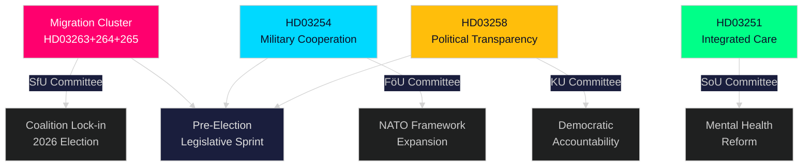

<!-- rtl -->
# סיכום מנהלים — הדופק בזמן אמת של הריקסדאג, 30 באפריל 2026

**Author**: James Pether Sörling
**Classification**: PUBLIC — GDPR Art. 9(2)(e,g)
**Confidence**: HIGH [B2]
**Run ID**: 25160664649

---

## 🎯 BLUF

ממשלת קריסטרסון ביצעה ביום 30 באפריל 2026 גל חקיקה יוצא דופן, והגישה חבילת הצעות שנייה גדולה המרכזת סמכויות אכיפה בשלושה הצעות חוק הגירה קשורות זו בזו, לצד מסגרת שיתוף פעולה ביטחוני חדשנית ורפורמת שקיפות פוליטית. בשילוב עם תוכנית התשתיות בסך 970 מיליארד קרון שוודי של החבילה הראשונה והצעות המעבר האנרגטי של האופוזיציה, יום בודד זה מייצג את תפוקת החקיקה הצפופה ביותר של מושב הריקסדאג 2025/26 — ספרינט מחושב לפני הבחירות שנועד לגבש את זהות החוק-הסדר-ביטחון של ברית Tidö לקראת בחירות סתיו 2026.

## 🧭 3 החלטות שסיכום זה תומך בהן

| # | החלטה | רלוונטיות | אופק |
|---|-------|-----------|------|
| 1 | כיול סיכון פוליטי לארגונים הפועלים במרחב ההגירה/האכיפה של שוודיה | HD03263+264+265 מחמירים בו-זמנית גירוש, התנהגות שוהים ומעצר — שינוי פרדיגמה מתואם בארכיטקטורת האכיפה | 2026–2027 |
| 2 | מיצוב ביטחוני ותאימות לגורמים בתעשיית הצבאית הרב-לאומית | HD03254 מרחיב את הבסיס המשפטי לשיתוף פעולה צבאי מבצעי במסגרת נאט"ו | מחצית שנייה 2026 |
| 3 | אסטרטגיית מעורבות פוליטית למפלגות ולחברה האזרחית בשקיפות דמוקרטית | HD03258 (שקיפות פוליטית) יגביל מימון מפלגות ופעילות לובי — משפיע על הנוף התחרותי | 2026–2028 |

## ⚡ קריאה של 60 שניות

- **אשכול אכיפת הגירה**: HD03263 (אכיפת גירוש), HD03264 (דרישות התנהגות לאישורי שהייה), HD03265 (כללי פיקוח/מעצר) — שלושה חוקים בו-זמניים מאותתים על הידוק שיטתי של ארכיטקטורת אכיפת ההגירה.
- **שיתוף פעולה ביטחוני** (HD03254): מסיר מחסומים משפטיים לשיתוף פעולה צבאי מבצעי עם מדינות שותפות במסגרת נאט"ו והסדרים דו-צדדיים. Pål Jonson (M), משרד הביטחון.
- **שקיפות פוליטית** (HD03258): Gunnar Strömmer (M), משרד המשפטים — דרישות שקיפות מוגברות בתהליכים פוליטיים, מכסה מימון מפלגות ולובי.
- **אינטגרציה בריאותית** (HD03251): Jakob Forssmed (KD), משרד הרווחה — טיפול משולב לאנשים עם התמכרות ומצבים פסיכיאטריים נלווים.
- **רוחבי**: תפוקת החקיקה של היום מניתוחים אחיים כוללת תוכנית תשתיות בסך 970 מיליארד, טרנספוזיציה בנקאית של האיחוד האירופי, אתגר המעבר האנרגטי של האופוזיציה, ופער ציות לחוק ה-AI שזוהה על ידי ועדת KU.
- **קריאה בחירותית**: הידוק הגירה + הרחבת ביטחון + רפורמת שקיפות = חתימה חקיקתית לפני הבחירות שנועדה לפנות לקואליציית המצביעים של Tidöallians ולנטרל את קווי ההתקפה של האופוזיציה.

## 🔮 טריגר מוביל עתידי

**קבלת ועדת אשכול אכיפת ההגירה (HD03263/264/265) ב-SfU (Socialförsäkringsutskottet), צפוי מאי–יוני 2026**: עמדת SD תהיה קריטית — כשותפה בכירה בתחום מדיניות ההגירה, הצבעות SD בוועדה יקבעו אם תיקוני ריכוך אפשריים יצליחו. עקוב אחר הצעות הנגד של S ו-MP בוועדה.

<!-- source-sha: 4982fc0535678625b509068942c6e0e28c6416e6 -->
