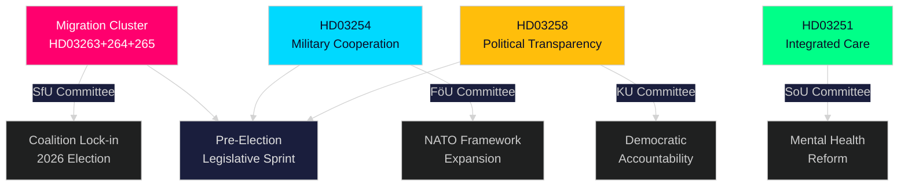

# エグゼクティブ・ブリーフ — リクスダーグ・リアルタイム・パルス、2026年4月30日

**Author**: James Pether Sörling
**Classification**: PUBLIC — GDPR Art. 9(2)(e,g)
**Confidence**: HIGH [B2]
**Run ID**: 25160664649

---

## 🎯 要点

クリステション政権は2026年4月30日、前例のない立法ラッシュを実施し、第二次大型提案パッケージを提出した。これは三つの連動した移民関連法案に執行権限を集中させるものであり、画期的な防衛協力枠組みと政治透明性改革を伴っている。第一パッケージの9,700億クローナのインフラ計画と野党のエネルギー転換動議を合わせると、この一日は2025/26年リクスダーグ会期で最も密度の高い立法生産を表している。これは2026年秋の選挙前にティドアリアンスの法と秩序・防衛アイデンティティを固めるための計算されたダッシュである。

## 🧭 このブリーフが支援する3つの意思決定

| # | 意思決定 | 関連性 | 時間軸 |
|---|---------|--------|--------|
| 1 | スウェーデンの移民・執行領域で活動する組織のための政治リスク較正 | HD03263+264+265が帰還、居住行動、収容を同時に強化 — 執行アーキテクチャにおける協調的パラダイムシフト | 2026–2027 |
| 2 | 多国籍軍事産業に関与する事業体の防衛分野ポジショニングとコンプライアンス | HD03254がNATO枠組み下での作戦軍事協力の法的根拠を拡大 | 2026年下半期 |
| 3 | 民主的透明性に関する政党と市民社会の政治エンゲージメント戦略 | HD03258（政治透明性）が党費資金調達とロビー活動を制約 — 競争環境に影響 | 2026–2028 |

## ⚡ 60秒のダイジェスト

- **移民執行クラスター**: HD03263（帰還執行）、HD03264（居住許可の行動要件）、HD03265（監督・収容規則）— 三つの同時立法が移民執行アーキテクチャの体系的強化を示している。
- **防衛協力**（HD03254）: NATO及び二国間取り決めの下、パートナー国との作戦軍事協力への法的障壁を撤廃。Pål Jonson（M）、国防省。
- **政治透明性**（HD03258）: Gunnar Strömmer（M）、法務省 — 政治プロセスにおける情報開示要件の強化、党費資金調達とロビー活動を対象。
- **医療統合**（HD03251）: Jakob Forssmed（KD）、社会省 — 依存症と共存する精神疾患を抱える人々への統合ケア。
- **横断的**: 関連分析からの今日の立法生産には、9,700億SEKインフラ計画、EU銀行転換、野党のエネルギー転換挑戦、KU委員会が特定したAI法準拠ギャップが含まれる。
- **選挙分析**: 移民強化 + 防衛拡張 + 透明性改革 = ティドアリアンス有権者連合に訴求し、野党の攻撃ラインを中和するための選挙前立法署名。

## 🔮 最重要先行指標

**SfU（Socialförsäkringsutskottet）での移民執行クラスター（HD03263/264/265）の委員会審議、2026年5月〜6月予定**: SDの立場が重要となる。移民政策分野の筆頭パートナーとして、SDの委員会投票が軟化修正案の成否を左右する。SとMPの委員会における対案に注目。

<!-- source-sha: 4982fc0535678625b509068942c6e0e28c6416e6 -->
