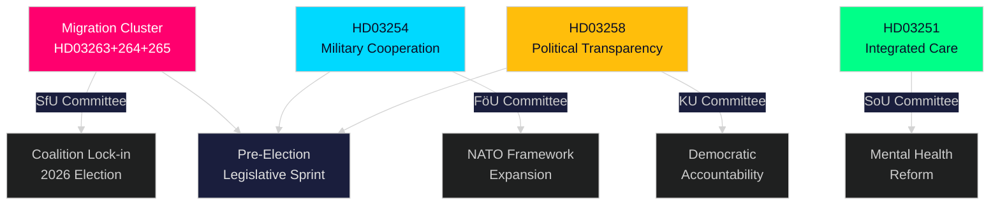

# 집행 브리핑 — 릭스다그 실시간 동향, 2026년 4월 30일

**Author**: James Pether Sörling
**Classification**: PUBLIC — GDPR Art. 9(2)(e,g)
**Confidence**: HIGH [B2]
**Run ID**: 25160664649

---

## 🎯 핵심 요약

크리스테르손 정부는 2026년 4월 30일 이례적인 입법 공세를 펼치며 두 번째 대형 법안 패키지를 제출했다. 이 패키지는 상호 연계된 세 가지 이민 법안에 집행 권한을 집중시키는 동시에, 획기적인 방위 협력 프레임워크와 정치 투명성 개혁을 포함하고 있다. 첫 번째 패키지의 9,700억 크로나 인프라 계획과 야당의 에너지 전환 동의안을 합산하면, 이 하루는 2025/26 릭스다그 회기 중 가장 밀도 높은 입법 생산일을 기록한다. 이는 2026년 가을 선거 전 티되알리안스의 법질서·방위 정체성을 고착시키기 위해 치밀하게 계획된 선거 전 막판 스퍼트다.

## 🧭 이 브리핑이 지원하는 3가지 의사결정

| # | 의사결정 | 관련성 | 시간 범위 |
|---|---------|--------|----------|
| 1 | 스웨덴 이민/집행 분야에서 활동하는 조직을 위한 정치적 리스크 보정 | HD03263+264+265가 귀환, 거주 행동, 구금을 동시에 강화 — 집행 아키텍처의 협조적 패러다임 전환 | 2026–2027 |
| 2 | 다국적 군사 산업 관련 기업의 방위 포지셔닝 및 컴플라이언스 | HD03254가 NATO 프레임워크 하에서 작전적 군사 협력의 법적 근거 확대 | 2026년 하반기 |
| 3 | 민주적 투명성에 관한 정당 및 시민사회의 정치 참여 전략 | HD03258(정치 투명성)이 정당 자금 조달과 로비 활동을 제한 — 경쟁 환경에 영향 | 2026–2028 |

## ⚡ 60초 요약

- **이민 집행 클러스터**: HD03263(귀환 집행), HD03264(거주 허가 행동 요건), HD03265(감독/구금 규정) — 세 가지 동시 법률이 이민 집행 아키텍처의 체계적 강화를 시사.
- **방위 협력** (HD03254): NATO 및 양자 합의에 따른 파트너 국가와의 작전 군사 협력에 대한 법적 장벽 철폐. Pål Jonson (M), 국방부.
- **정치 투명성** (HD03258): Gunnar Strömmer (M), 법무부 — 정치 과정의 정보 공개 요건 강화, 정당 자금 및 로비 활동 포함.
- **의료 통합** (HD03251): Jakob Forssmed (KD), 사회부 — 중독 및 동반 정신 질환자를 위한 통합 치료.
- **교차 분야**: 오늘의 관련 분석 입법 생산에는 9,700억 SEK 인프라 계획, EU 은행 전환, 야당의 에너지 전환 도전, KU 위원회가 식별한 AI 법 준수 격차가 포함됨.
- **선거 분석**: 이민 강화 + 방위 확대 + 투명성 개혁 = 티되알리안스 유권자 연합에 호소하고 야당의 공격 라인을 무력화하기 위한 선거 전 입법 서명.

## 🔮 주요 선행 촉발 요인

**SfU(Socialförsäkringsutskottet)의 이민 집행 클러스터(HD03263/264/265) 위원회 심의, 2026년 5~6월 예상**: SD의 입장이 결정적 — 이민 정책 영역의 선도적 파트너로서 SD의 위원회 투표가 완화 수정안 성사 여부를 결정. S와 MP의 위원회 내 대안 제안 주시.

<!-- source-sha: 4982fc0535678625b509068942c6e0e28c6416e6 -->
