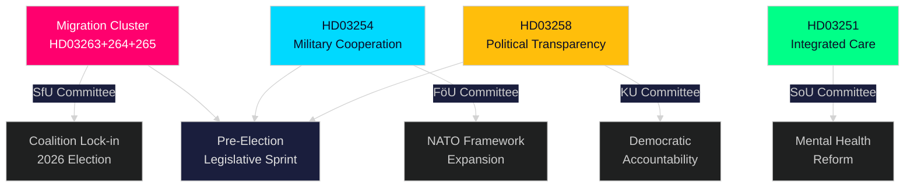

# Samenvatting — Rijksdag Realtime Puls, 30 april 2026

**Author**: James Pether Sörling
**Classification**: PUBLIC — GDPR Art. 9(2)(e,g)
**Confidence**: HIGH [B2]
**Run ID**: 25160664649

---

## 🎯 BLUF

De Kristersson-regering heeft op 30 april 2026 een buitengewone wetgevingsstoot uitgevoerd en een tweede groot propositionenpakket ingediend dat handhavingsmacht concentreert in drie onderling verbonden migratiewetten naast een baanbrekend kader voor defensiesamenwerking en een politieke transparantiereform. Gecombineerd met het 970 miljard SEK infrastructuurplan van het eerste pakket en de energietransitie-moties van de oppositie vertegenwoordigt deze ene dag de dichtstebevolkte wetgevingsproductie van de Riksdag-sessie 2025/26 — een berekende pre-verkiezingssprint om de wet-en-orde- en defensie-identiteit van de Tidöallians te verankeren voor de najaarverkiezingen van 2026.

## 🧭 3 Beslissingen die deze samenvatting ondersteunt

| # | Beslissing | Relevantie | Horizon |
|---|-----------|------------|---------|
| 1 | Politieke risicocalibratie voor organisaties actief in Zweden's migratie-/handhavingsruimte | HD03263+264+265 verscherpen terugkeer, verblijfsgedrag en detentie gelijktijdig — een gecoördineerde paradigmawisseling in de handhavingsarchitectuur | 2026–2027 |
| 2 | Defensiepositionering en naleving voor actoren in de multinationale militaire industrie | HD03254 breidt de juridische grondslag uit voor operationele militaire samenwerking binnen het NAVO-kader | 2026 H2 |
| 3 | Politieke betrokkenheidsstrategie voor partijen en maatschappelijk middenveld over democratische transparantie | HD03258 (politieke transparantie) zal partijfinanciering en lobbyen beperken — beïnvloedt het concurrentielandschap | 2026–2028 |

## ⚡ 60-seconden lezing

- **Migratie-handhavingscluster**: HD03263 (terugkeerhandhaving), HD03264 (gedragsvereisten voor verblijfsvergunningen), HD03265 (toezichts-/detentieregels) — drie simultane wetten signaleren een systemische verscherping van de migratie-handhavingsarchitectuur.
- **Defensiesamenwerking** (HD03254): Verwijdert juridische barrières voor operationele militaire samenwerking met partnernaties binnen het NAVO-kader en bilaterale regelingen. Pål Jonson (M), Ministerie van Defensie.
- **Politieke transparantie** (HD03258): Gunnar Strömmer (M), Ministerie van Justitie — verhoogde inzichtsvereisten in politieke processen, omvat partijfinanciering en lobbyen.
- **Zorgintegratie** (HD03251): Jakob Forssmed (KD), Ministerie van Sociale Zaken — geïntegreerde zorg voor personen met verslaving en gelijktijdige psychiatrische aandoeningen.
- **Dwars**: De wetgevingsoutput van de dag uit zusteranalyses omvat het 970 mrd. SEK infrastructuurplan, EU-banktranspositie, de energietransitie-uitdaging van de oppositie en een AI-wet-nalevingshiaat geïdentificeerd door de KU-commissie.
- **Verkiezingslezing**: Migratieverscherping + defensie-uitbreiding + transparantiereform = een pre-verkiezings-wetgevingshandtekening ontworpen om de kiezerscoalitie van de Tidöallians aan te spreken en aanvalslijnen van de oppositie te neutraliseren.

## 🔮 Belangrijkste voorwaartse trigger

**Commissiebehandeling van het migratie-handhavingscluster (HD03263/264/265) in de SfU (Socialförsäkringsutskottet), verwacht mei–juni 2026**: SD's positie zal cruciaal zijn — als hoofdpartner op het migratiebeleidsterrein zullen SD's commissiestemmen bepalen of eventuele verzachtende wijzigingen slagen. Let op tegenstellen van S en MP in de commissie.

<!-- source-sha: 4982fc0535678625b509068942c6e0e28c6416e6 -->
