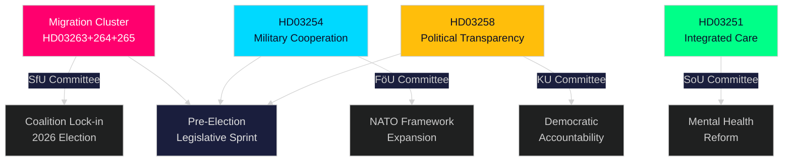

# Kortfattet Orientering — Stortingets Sanntidspuls, 30. april 2026

**Author**: James Pether Sörling
**Classification**: PUBLIC — GDPR Art. 9(2)(e,g)
**Confidence**: HIGH [B2]
**Run ID**: 25160664649

---

## 🎯 BLUF

Kristersson-regjeringen har gjennomført et ekstraordinært lovgivningsrykk 30. april 2026 og levert inn en andre større proposisjonspakke som konsentrerer håndhevelsesmakt i tre sammenkoblede migrasjonslovgivninger ved siden av et banebrytende rammeverk for forsvarssamarbeid og en politisk transparensreform. Kombinert med den første pakkens infrastrukturplan på 970 milliarder SEK og opposisjonens energiomstillingsforslagstillinger representerer denne enkelt dagen den tetteste lovgivningsproduksjonen i 2025/26 Riksdag-sesjonen — et beregnet valgspurt designet for å låse Tidöalliansens lov-og-orden og forsvarsidentitet fast før høstens valg 2026.

## 🧭 3 Beslutninger som denne orienteringen støtter

| # | Beslutning | Relevans | Horisont |
|---|-----------|----------|----------|
| 1 | Politisk risikokalibrering for organisasjoner som opererer i Sveriges migrasjons-/håndhevelsesrom | HD03263+264+265 strammer retur, bostedsadferd og internering simultant — et koordinert paradigmeskifte i håndhevelsesarkitekturen | 2026–2027 |
| 2 | Forsvarsposisjonering og etterlevelse for aktører i multinasjonell militærindustri | HD03254 utvider det juridiske grunnlaget for operativt militært samarbeid under NATO-rammeverket | 2026 H2 |
| 3 | Politisk påvirkningsstrategi for partier og sivilsamfunn om demokratisk transparens | HD03258 (politisk transparens) vil begrense partifinansering og lobbyvirksomhet — påvirker det konkurransemessige landskapet | 2026–2028 |

## ⚡ 60-sekunders lesning

- **Migrasjonshåndhevelsesklynge**: HD03263 (returhåndhevelse), HD03264 (atferdskrav for oppholdstillatelse), HD03265 (tilsyns-/interneringsregler) — tre simultane lovgivninger signaliserer en systemisk innstramming av migrasjonshåndhevelsesarkitekturen.
- **Forsvarssamarbeid** (HD03254): Fjerner juridiske barrierer for operativt militært samarbeid med partnernasjoner under NATO og bilaterale arrangementer. Pål Jonson (M), Forsvarsdepartementet.
- **Politisk transparens** (HD03258): Gunnar Strömmer (M), Justisdepartementet — økte innsiktsrettigheter i politiske prosesser, dekker partifinansering og lobbyvirksomhet.
- **Helseintegrasjon** (HD03251): Jakob Forssmed (KD), Sosialdepartementet — integrert omsorg for personer med avhengighet og samtidige psykiatriske tilstander.
- **Tverrfaglig**: Dagens lovgivningsoutput fra søsteranalyser inkluderer 970 mrd. SEK infrastrukturplan, EU-banktransponering, opposisjonens energiomstillingsutfordring og AI Act-samsvarsmanko identifisert av KU.
- **Valglesning**: Innstramming av migrasjon + forsvarsutvidelse + transparensreform = en forvalgssignatur designet for å appellere til Tidöalliansens velgerkoalisjon og nøytralisere opposisjonens angrepslinjer.

## 🔮 Topp fremtidsutløser

**Komitébehandling av migrasjonshåndhevelsesklyngen (HD03263/264/265) i SfU (Socialförsäkringsutskottet), forventet mai–juni 2026**: SD's posisjon vil være avgjørende — som ledende partner i migrasjonspolitikkområdet vil SD's komitéavstemninger avgjøre om eventuelle lempende endringer lykkes. Overvåk S og MP's motforslag i komiteen.

<!-- source-sha: 4982fc0535678625b509068942c6e0e28c6416e6 -->
