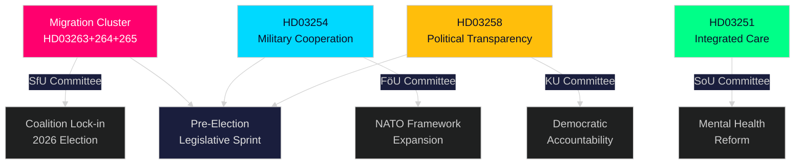

# Verkställande sammanfattning — Riksdagens realtidspuls, 30 april 2026

**Author**: James Pether Sörling
**Classification**: PUBLIC — GDPR Art. 9(2)(e,g)
**Confidence**: HIGH [B2]
**Run ID**: 25160664649

---

## 🎯 BLUF

Kristersson-regeringen har genomfört en extraordinär lagstiftningssurge den 30 april 2026 och lämnat in ett andra stort propositionspaket som koncentrerar verkställighetsmakt i tre sammanlänkade migrationslagstiftningar, vid sidan av ett banbrytande försvarssamarbetsramverk och en politisk transparensreform. Kombinerat med det första paketets infrastrukturplan på 970 miljarder SEK och oppositionens energiomställningsmotioner representerar denna enda dag den tätaste lagstiftningsproduktionen under 2025/26 års riksdagssession — en kalkylerad förvalspurt utformad för att befästa Tidöalliansens lag-och-ordnings- och försvarsidentitet inför höstens val 2026.

## 🧭 3 beslut som denna sammanfattning stöder

| # | Beslut | Relevans | Horisont |
|---|--------|----------|----------|
| 1 | Politisk riskkalibrering för organisationer som verkar inom Sveriges migrations- och verkställighetssfär | HD03263+264+265 skärper återvändande, boendeuppträdande och förvar simultant — ett koordinerat paradigmskifte inom verkställighetsarkitekturen | 2026–2027 |
| 2 | Försvarspositionering och efterlevnad för aktörer inom multinationell militärindustri | HD03254 utökar den rättsliga grunden för operativt militärt samarbete inom NATO-ramen | 2026 H2 |
| 3 | Politisk påverkansstrategi för partier och civilsamhälle kring demokratisk transparens | HD03258 (politisk transparens) kommer att begränsa partifinansering och lobbying — påverkar det konkurrensmässiga landskapet | 2026–2028 |

## ⚡ 60-sekunders läsning

- **Migrationsverkställighetskluster**: HD03263 (återvändandeverkställighet), HD03264 (uppförandekrav för uppehållstillstånd), HD03265 (tillsyns-/förvaringsregler) — tre simultana lagstiftningar signalerar en systemisk åtstramning av migrationsverkställighetsarkitekturen.
- **Försvarssamarbete** (HD03254): Undanröjer rättsliga hinder för operativt militärt samarbete med partnernationer under NATO och bilaterala arrangemang. Pål Jonson (M), Försvarsdepartementet.
- **Politisk transparens** (HD03258): Gunnar Strömmer (M), Justitiedepartementet — ökade insiktsrättigheter i politiska processer, täcker partifinansering och lobbying.
- **Sjukvårdsintegration** (HD03251): Jakob Forssmed (KD), Socialdepartementet — integrerad vård för personer med beroende och samsjuklighet i psykiatriska tillstånd.
- **Tvärgående**: Dagens lagstiftningsproduktion från syskonanalyser inkluderar 970 miljarder SEK infrastrukturplan, EU-banktransponering, oppositionens energiomställningsutmaning och AI-aktefterlev­nads­lucka identifierad av KU.
- **Valläsning**: Migrationsåtstramning + försvarsexpansion + transparensreform = en förvals­lagstiftningssignatur utformad för att appellera till Tidöalliansens väljarkoalition och neutralisera oppositionens attacklinjer.

## 🔮 Topp framåtutlösare

**Utskottsmottagande av migrationsverkställighetsklustret (HD03263/264/265) i SfU (Socialförsäkringsutskottet), förväntat maj–juni 2026**: SD:s position kommer att vara avgörande — som ledande partner inom migrationspolitikområdet kommer SD:s utskottsröster att avgöra om eventuella mildrandeändringar lyckas. Bevaka S och MP:s motförslag i utskottet.

<!-- source-sha: 4982fc0535678625b509068942c6e0e28c6416e6 -->
