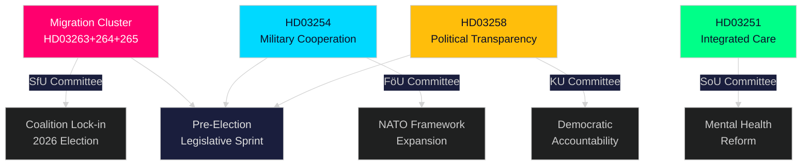

# 执行简报 — 瑞典议会实时动态，2026年4月30日

**Author**: James Pether Sörling
**Classification**: PUBLIC — GDPR Art. 9(2)(e,g)
**Confidence**: HIGH [B2]
**Run ID**: 25160664649

---

## 🎯 核心摘要

克里斯特松政府于2026年4月30日发起了一场非同寻常的立法冲刺，提交了第二批大型法案包，将执法权力集中于三项相互关联的移民法案，同时附带一项具有开创性的国防合作框架及政治透明度改革。加上第一批方案中9700亿瑞典克朗的基础设施计划和反对党的能源转型动议，这单一一天代表2025/26年议会届期中立法产出最为密集的一天——这是一次精心计算的大选前冲刺，旨在于2026年秋季大选前巩固Tidöallians的法律秩序与国防身份认同。

## 🧭 本简报支持的3项决策

| # | 决策 | 相关性 | 时间范围 |
|---|------|--------|---------|
| 1 | 为在瑞典移民/执法领域运营的机构进行政治风险校准 | HD03263+264+265同步收紧遣返、居留行为与拘留规定——执法架构的协调性范式转变 | 2026–2027 |
| 2 | 跨国军事工业参与者的国防战略定位与合规 | HD03254扩大了北约框架下作战军事合作的法律依据 | 2026年下半年 |
| 3 | 政党及公民社会关于民主透明度的政治参与策略 | HD03258（政治透明度）将限制党派资金募集与游说活动——影响竞争格局 | 2026–2028 |

## ⚡ 60秒速读

- **移民执法集群**：HD03263（遣返执法）、HD03264（居留许可行为要求）、HD03265（监督/拘留规定）——三项同步立法标志着移民执法架构的系统性收紧。
- **国防合作**（HD03254）：消除与北约及双边安排框架下伙伴国开展作战军事合作的法律障碍。Pål Jonson（M），国防部。
- **政治透明度**（HD03258）：Gunnar Strömmer（M），司法部——加强政治进程中的信息披露要求，涵盖政党资金和游说活动。
- **医疗整合**（HD03251）：Jakob Forssmed（KD），社会事务部——为同时患有成瘾症和精神障碍的人员提供综合护理。
- **横向关联**：今日来自姊妹分析的立法产出包括9700亿瑞克朗基础设施计划、欧盟银行业转化指令、反对党的能源转型挑战，以及KU委员会识别出的人工智能法规合规缺口。
- **选举解读**：移民收紧 + 国防扩展 + 透明度改革 = 一项旨在吸引Tidöallians选民联盟并化解反对党攻击路线的大选前立法标志。

## 🔮 最重要前瞻性触发因素

**SfU（Socialförsäkringsutskottet）对移民执法集群（HD03263/264/265）的委员会审议，预计2026年5月至6月**：SD的立场至关重要——作为移民政策领域的核心伙伴，SD在委员会的投票将决定任何软化修正案能否通过。关注S和MP在委员会中的反提案动向。

<!-- source-sha: 4982fc0535678625b509068942c6e0e28c6416e6 -->
