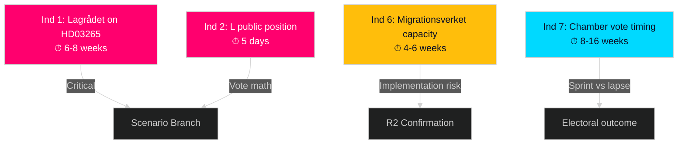

# Forward Indicators — Realtime Pulse 2026-04-30

**Author**: James Pether Sörling | **Date**: 2026-04-30 | **Confidence**: MEDIUM [B2]

---

## Indicator Framework (10 indicators across 4 horizons)

### Horizon 1: Immediate (0-2 weeks)

| # | Indicator | Source | Trigger Condition | Significance |
|---|-----------|--------|-----------------|-------------|
| 1 | Lagrådet issues advisory on HD03265 | Lagrådet.se | Published within 6-8 weeks of submission | Tone (approving/critical) determines scenario branch: Full Sprint vs Partial Passage. Watch for: "Det saknas tillräckliga skäl" (insufficient grounds) as red flag. |
| 2 | L (Liberalerna) press conference on HD03265 | Liberalerna.se / riksdagen.se | Within 5 days of submission | L dissent would signal 3-seat majority vulnerability on migration cluster. Watch for: Birgitta Ohlsson or Johan Pehrson statements. |
| 3 | UNHCR Sweden statement on HD03263-265 | UNHCR Sweden press releases | Within 48 hours of publication | Standard UNHCR response; if more critical than usual, signals international pressure. |

### Horizon 2: Short-term (2-8 weeks)

| # | Indicator | Source | Trigger Condition | Significance |
|---|-----------|--------|-----------------|-------------|
| 4 | SfU (Social Affairs Committee) hearing date set for HD03263-265 | riksdagen.se calendar | Committee chair announces hearing schedule | Late scheduling (after June 15) increases risk of election-window lapse. |
| 5 | FöU (Defence Committee) votes on HD03254 | riksdagen.se voteringar | Committee stage vote | Near-unanimous positive vote confirms broad defence consensus. |
| 6 | Migrationsverket requests phased implementation from SfU | riksdagen.se dokument | Agency formal submission to committee | Would confirm R2 (implementation overload risk) is materialising. |

### Horizon 3: Medium-term (8-16 weeks: May-August 2026)

| # | Indicator | Source | Trigger Condition | Significance |
|---|-----------|--------|-----------------|-------------|
| 7 | Chamber vote on HD03263+264 | riksdagen.se voteringar | Vote occurs before August 1 | Passage before August confirms Full Sprint scenario. Vote after August 1 increases election-timing risk. |
| 8 | HD03265 resubmission after Lagrådet amendment | riksdagen.se dokument | Second version submitted | Confirms Lagrådet required changes — partial Scenario 2 materialising. |
| 9 | Opinion poll (Sifo/Novus) migration salience index | Sifo.se / Novus.se | Migration as top issue >35% of respondents | If migration rises further in salience, confirms legislative sprint is energising SD/M voters as intended. |

### Horizon 4: Election-cycle (August-September 2026)

| # | Indicator | Source | Trigger Condition | Significance |
|---|-----------|--------|-----------------|-------------|
| 10 | Tidöalliansen election manifesto references HD03263-265 as achievements | Party websites | Published August-September 2026 | Confirms government intends to campaign on these laws; validates pre-election sprint hypothesis from today's analysis. |

## Indicator Priority Stack

