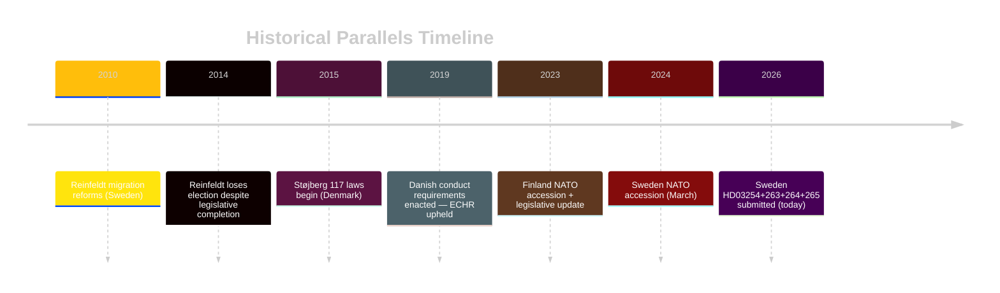

# Historical Parallels — Realtime Pulse 2026-04-30

**Author**: James Pether Sörling | **Date**: 2026-04-30 | **Confidence**: MEDIUM [B2]

---

## Parallel 1: The Reinfeldt Migration Sprint 2010-2014

**Context**: The Reinfeldt government (M-led Alliance 2006-2014) passed a series of migration-related legislative changes in the final two years of its term, including labour migration liberalisation (2008) and asylum process reforms (2010-2013). The government used legislation as both policy and campaign signal.

**Parallel**: Like today's Tidöalliansen, the Reinfeldt government bundled migration legislation with economic reform and defence modernisation ahead of the 2014 election. Key difference: Reinfeldt's migration policy was more liberal than today's enforcement focus — but the legislative sprint pattern is identical.

**Lesson**: The Reinfeldt government lost the 2014 election despite completing its legislative programme. Policy delivery does not guarantee electoral success; economic sentiment was the decisive factor.

## Parallel 2: Denmark's Støjberg Laws 2015-2019

**Context**: Danish Immigration Minister Inger Støjberg (V/Liberal) passed 117 immigration-tightening laws between 2015-2019, including family reunification restrictions, conduct requirements, and asset seizure ("jewellery law"). This directly parallels HD03263 (return enforcement) + HD03264 (conduct requirements).

**Parallel**: The Danish "conduct for residence" model (comparable to HD03264) was enacted in 2019. It survived ECHR challenge. This provides direct legal precedent that the Swedish version (HD03264) is ECHR-compatible.

**Lesson**: The Danish experience shows that conduct requirements for residence permits are legally durable. It also shows that such laws tend to escalate — each enforcement cycle requires new legislation.

## Parallel 3: Sweden's NATO Accession Legislation — Finland Precedent

**Context**: Finland joined NATO in April 2023 and had to update national legislation for operational military cooperation within 12 months. Finland passed its military cooperation legal framework (Suomi–Nato sopimus) by Q1 2024.

**Parallel**: Sweden's HD03254 follows the same 12-18 month post-accession legislative normalisation pattern. Sweden joined NATO March 2024; HD03254 submitted April 2026 = 25 months post-accession — slightly slower than Finland.

**Lesson**: This is normal NATO integration behaviour. No political risk signal — this is bureaucratic compliance.

