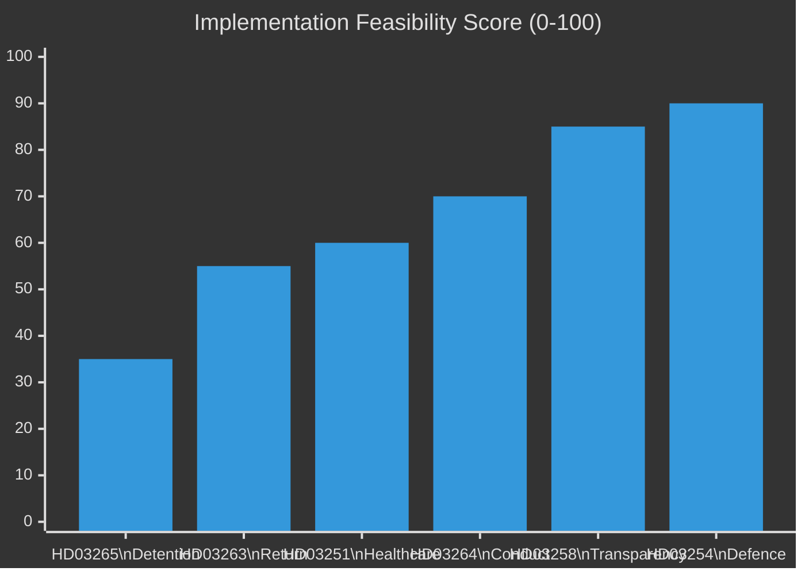

# Implementation Feasibility — Realtime Pulse 2026-04-30

**Author**: James Pether Sörling | **Date**: 2026-04-30 | **Confidence**: MEDIUM [B2]

---

## Feasibility Assessment Matrix

| Bill | Implementing Agency | Readiness | Key Dependencies | Feasibility | Statskontoret |
|------|--------------------|---------|--------------------|-------------|---------------|
| HD03263 (Return enforcement) | Polismyndigheten + Migrationsverket | MEDIUM | Police operational capacity, bilateral return agreements | MEDIUM | none found |
| HD03264 (Conduct requirements) | Migrationsverket | MEDIUM-HIGH | Decision framework update, staff training | MEDIUM-HIGH | none found |
| HD03265 (Detention) | Migrationsverket + Courts | LOW-MEDIUM | Detention facility capacity, IT system update, Lagrådet approval | LOW-MEDIUM | none found |
| HD03254 (Military cooperation) | Försvarsmakten + FMV | HIGH | Existing NATO framework, bilateral agreements | HIGH | none found |
| HD03258 (Transparency) | Valmyndigheten + Partier | HIGH | Existing reporting infrastructure | HIGH | none found |
| HD03251 (Healthcare) | Socialstyrelsen + Regioner | MEDIUM | Regional implementation variation, IT integration | MEDIUM | none found |

## Critical Path Analysis

### HD03265 (Detention) — Critical Path Items
1. Lagrådet advisory opinion → amendment if required → re-referral (4-8 weeks)
2. SfU committee hearing (2-3 weeks)
3. Chamber vote (1 week)
4. Migrationsverket detention facility assessment (parallel, 4-6 weeks)
5. IT system update for detention orders (parallel, 8-12 weeks)
**Total critical path**: 12-16 weeks minimum → tight against September 13 election.

### HD03254 (Military Cooperation) — Rapid Implementation
1. Lagrådet review (low risk — 2 weeks)
2. FöU committee (2 weeks — broad support)
3. Chamber vote (1 week)
4. Försvarsmakten legal update (parallel, concurrent)
**Total critical path**: 5-6 weeks → comfortably before election.

## Statskontoret Relevance Row

| Bill | Statskontoret Review | Finding |
|------|---------------------|---------|
| HD03263 | none found | No prior Statskontoret review of return enforcement implementation found in cache |
| HD03264 | none found | No prior Statskontoret review found |
| HD03265 | none found | No prior Statskontoret review found |
| HD03254 | none found | No prior Statskontoret review found |
| HD03258 | none found | No prior Statskontoret review found |
| HD03251 | none found | SOU 2021:93 provides related evidence (integrated care) but no Statskontoret-specific review found |

