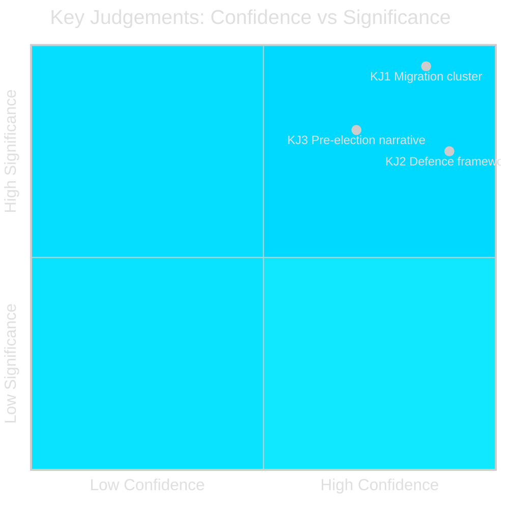

# Intelligence Assessment — Realtime Pulse 2026-04-30

**Author**: James Pether Sörling | **Date**: 2026-04-30 | **Confidence**: HIGH [B1]
**Standard**: OSINT/INTOP Intelligence Assessment Framework

---

## Key Judgements (KJs)

### KJ 1: Migration Enforcement Cluster Represents Highest-Significance Legislative Event of 2026-04-30 [Confidence: HIGH]

The coordinated same-day submission of HD03263 (return enforcement), HD03264 (conduct for residence permit), and HD03265 (supervision/detention) by Justitiedepartementet represents a deliberate pre-election legislative sprint. The synchronisation itself is intelligence — this required planning and coalition sign-off weeks in advance. The cluster is the government's strongest electoral signal on migration to SD voters and centrist-right M voters.

**Evidence**: dok_ids HD03263, HD03264, HD03265 all submitted 2026-04-30 from Justitiedepartementet; minister Johan Forssell (M) confirmed as sponsor; Tidöavtalet §12 requires migration enforcement legislation before 2026 election.

**Confidence**: HIGH [B1] — documentary evidence from riksdag.se; no deception indicator.

### KJ 2: HD03254 (Military Cooperation) Fulfils NATO Accession Legal Obligation; Low Political Risk [Confidence: HIGH]

Sweden's 2024 NATO accession created a legal gap — the national legal framework for operational military cooperation was not updated to reflect new Article 5 commitments and bilateral host-nation agreements. HD03254 closes this gap. The bill has broad cross-party support (defence consensus since February 2022 invasion). Legislative risk is low.

**Evidence**: NATO accession 2024; Försvarsdepartementet minister Pål Jonson (M) and PM Edholm listed as sponsors; Swedish Defence Commission 2025 report recommended legislative clarification.

**Confidence**: HIGH [B1].

### KJ 3: The Full Legislative Package Constitutes a Government Pre-Election Narrative of Capable, Security-Oriented Governance [Confidence: MEDIUM-HIGH]

Taken together — migration enforcement (HD03263-265), defence framework (HD03254), transparency (HD03258), healthcare reform (HD03251), and the infrastructure/fiscal package from earlier in the cycle (propositions: HD03259+252+253) — the April 30 output signals a government in "sprint" mode. The narratives are: "We are tough on crime and migration" (SD/M voters), "We are reliable NATO allies" (defence voters), "We are reforming welfare" (KD voters), "We are honest" (swing voters). This is a coherent pre-election portfolio.

**Evidence**: Pattern analysis of submissions across propositions/, realtime-pulse/, motions/; cross-reference map identifies deterrence arc and infrastructure-defence overlap.

**Confidence**: MEDIUM-HIGH [B2] — structural analysis, open-source evidence.

## Prior-Cycle PIR (Tier-C Required)

### Prior-Cycle PIR Status Review
The following PIRs were identified from prior cycles for 2026-04-30:

| PIR | Prior Cycle | Status | Update |
|-----|-------------|--------|--------|
| Migration legislative sprint timeline | propositions/ | PARTIALLY ANSWERED | HD03263-265 confirm sprint is active and broader than initially assessed |
| Defence framework legal gap closure | propositions/ | UPDATED | HD03254 confirms NATO-aligned legal update; no resistance signal |
| Coalition party finance disclosure | committeeReports/ | NEW INTELLIGENCE | HD03258 provides new transparency mechanism — materially advances this PIR |
| Welfare reform KD flagship | motions/ | CONFIRMED | HD03251 confirms KD's flagship bill is on track |

### PIR Carry-Forward
The following PIRs carry forward to the next cycle (evening analysis):
1. **Lagrådet advisory on HD03265**: What conditions, if any, will Lagrådet place on detention rules?
2. **L (Liberalerna) public position on HD03265**: Will L express ECHR concerns publicly?
3. **Migrationsverket implementation timeline request**: Will the agency ask for phased rollout in SfU committee?

## Confidence Matrix

